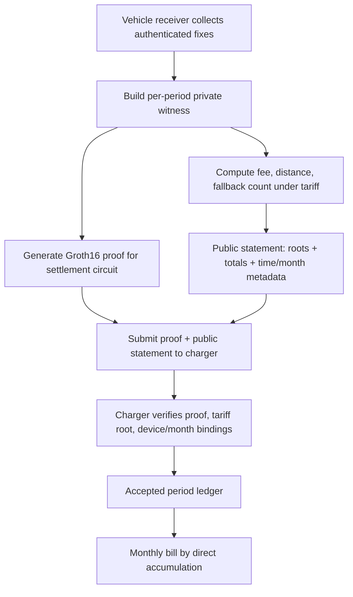

# TSIP-RUC 完整设计文档

> 日期：2026-06-10  
> 仓库：`/Users/wanghao/Desktop/risefl_mvp`  
> 目的：把当前 TSIP-RUC 的论文设计、协议语义、工程实现、实验进展、已知问题和下一步计划汇总成一份可继续迭代的设计文档。  
> 重要口径：本文档优先记录当前仓库和真实 runner 输出。历史 handoff 中已经被后续实验推翻或修正的判断，以本文档为准。

---

## 0. 一页摘要

TSIP-RUC 是把 TSIP 的时空完整性证明思想迁移到道路使用计费（Road Usage Charging, RUC）的隐私保护结算系统。核心目标不是做位置聚合，而是让每个车辆在不上传完整轨迹的前提下提交一份可验证账单：账单必须按公开 tariff 表正确计算，轨迹必须满足认证时间、速度、连续性、里程和区域计费约束。

论文 thesis 建议谨慎写成：

> TSIP-RUC is the first RUC design point that jointly supports zone-based charging, strong route privacy, and zero roadside enforcement infrastructure, at the cost of a stronger trusted receiver / odometer assumption.

投稿时建议加限定词：

> To our knowledge, TSIP-RUC is the first design point in this space ...

理由：2025-2026 的 zk location proof、TEE-based metering、authenticated GNSS 和 ETC/RUC 文献需要投稿前再扫一遍。"first" 的成立依赖清楚限定设计空间：**区域计费 + 路线隐私 + 零路侧执法基础设施 + policy-free TCB**。

当前最重要的实证结论：

- **E1 已基本完成**：GeoLife 是主 economic anchor，Rome 官方 tariff 是辅证，四数据集 pinned OSNMA replay 均为 0 realized savings。E1 直接回应 desk-reject 根因：密码学组件确实改变经济账单。
- **E2 已增强完成**：从 absolute fallback-rate sweep 升级为 normalized alpha、break-even threshold CDF、controlled outage fairness cost 和 epsilon-incentive-compatibility 表。
- **E6 单 period 性能可引用**：当前本机 `snarkjs` run 为 witness `~662 ms`、prove `~7.13 s`、verify `~223 ms`、proof JSON `805 bytes`、public signals `21`；历史多次 run 在 prove `~8 s` 左右。
- **E3 已完成四数据集全量 residual sweep**：权威目录 `experiments/e3_relay_residual_all4/`(GeoLife 14 + Rome 66 moving + Porto 8 moving,radius 至 400m),最坏格点 Rome fine/intra_cell/400m p95 residual `0.507`;定位为 bucketed RCSPP upper-bound。
- **E4/E5 baseline 体系已完成**(2026-06-11):E4 有 observed proxy + 真实 drivable graph 双宇宙、检出曲线、等检出工作点和 R/T/Z head-to-head;Baseline R 经验仿真器显示等检出工作点上 spot-check 的诚实路线可见度为 1.0(`e5_leakage_spectrum.csv`);E6 rapidsnark 已实测 median 1.389s/proof。

当前必须诚实写出的工程债：

- `circuits/settlement_period_v5_k6.circom` 曾因恢复事故退回 15-signal wrapper；已补回 21-signal public list，并增加 wrapper / prover / charger / artifact 一致性回归。该问题现在是**已修复接口不变量**，后续必须保持回归。
- 当前 charger 原型的 `/settlement/period` API 仍接收 `fixes` 以做签名验证和 public statement 复核。这是 settlement-correctness / submission-gate 工程路径，不等同于最终隐私部署路径。论文的隐私协议必须是 proof/public-statement 路径，只公开账单、roots 和少量元数据，不上传 raw fixes。

---

## 1. 研究问题与设计定位

### 1.1 原始问题

道路使用计费系统需要按车辆实际行驶位置和距离收费。2025-2026 的政策与硬件背景使这个问题从"未来假设"变成现实窗口：

- RUC 正在从试点走向强制化，隐私是最强反对理由之一。
- 欧盟 Smart Tachograph 2 / Galileo OSNMA 等认证定位硬件正在法规化部署；其中 **2025-12-24 起新注册商用车的 Smart Tachograph 2 要求**是商用车场景的重要现实锚点。
- 现有隐私 RUC 谱系仍主要停留在路侧抽查/RSU/spot-check 时代，而 zk location proof 前沿多解决"位置谓词证明"，尚未解决"认证轨迹 + 物理可行性 + tariff 计费"的合取证明。

传统隐私保护 RUC 方案通常在以下三者之间取舍：

1. **区域计费能力**：不同 zone 或道路有不同费率，而不只是总里程费。
2. **路线隐私**：收费方不能看到完整 GPS 轨迹。
3. **执法基础设施**：不依赖城市级路侧摄像头、RSU 或巡逻 spot-check。

VPriv、PrETP、Milo 等经典 RUC 系统使用密码学保护隐私，但其作弊检出依赖路侧抽查设备或执法摄像头。TSIP-RUC 的设计点是：用设备侧认证 + zk-SNARK 证明替代大规模路侧基础设施。

这可以概括为 RUC 三难困境：

```text
Zone-based charging + Route privacy + No roadside enforcement
```

传统方案至多同时满足其中两项；TSIP-RUC 选择引入认证 receiver / odometer 假设，换取第三项。

### 1.2 与原 TSIP 位置聚合的差异

原 TSIP 面向隐私保护位置聚合，关心 DP utility、聚合质量和恶意客户端污染。RUC 版本没有聚合层；每个 period proof 直接决定一笔账单。因此评估方式也不同：

- 原 TSIP：看恶意数据是否污染 aggregate。
- TSIP-RUC：看关闭某个密码学组件后，理性对手能少付多少钱。

这正是 E1 设计的核心：每一行消融都对应一个经济攻击面。

### 1.3 设计空间位置

| 系统类别 | 区域计费 | 路线隐私 | 路侧基础设施 | 主要代价 |
|---|---:|---:|---:|---|
| 明文 GPS 上传 | ✓ | ✗ | 低 | 隐私不可接受 |
| 总里程 odometer-only | ✗ | ✓ | 低 | 无法区域计费 |
| Smart tachograph / trusted-reader 现状 | ✓ | ✗/弱 | 低 | 认证轨迹交给检查方 |
| VPriv / PrETP / Milo spot-check 谱系 | ✓ | 部分/强 | 高 | 需要城市级抽查基础设施 |
| P4TC / RSU ETC 谱系 | ✓ | 部分/强 | 高 | 收费交互绑定路侧单元 |
| TEE 计费 | ✓ | 强 | 0 | 计费策略进入 TCB |
| ZK location proof 谓词系统 | 部分 | 强 | 视部署而定 | 证明位置谓词，不绑定完整账单 |
| TSIP-RUC | ✓ | 强（目标协议） | 0 | 需要可信 receiver / odometer / OSNMA 假设 |

注意 PrETP 的重要对偶：它主张不需要 tamper-proof element，但代价是路侧抽查；TSIP-RUC 则利用正在法规化的认证 receiver，换掉路侧基础设施。

---

## 2. Threat Model 与信任边界

### 2.1 参与方

- **Vehicle / Receiver**：车载接收器，产生认证 GNSS fix、odometer reading、nonce、签名或设备 attestation。
- **Charger**：收费方，维护 tariff、设备注册表、月度 ledger，验证 proof 和 public statement。
- **Tariff authority**：发布 tariff table 和 zone-rate mapping。
- **Adversarial user**：希望少付费，可能选择性声明 outage、伪造路径、删除 fix、重放或替换区域声明。

### 2.2 可信假设

当前设计依赖以下假设：

- **GNSS/OSNMA 认证**：每个 accepted fix 的时间、位置 cell 和状态来自认证 receiver。
- **设备私钥 / attestation 不可伪造**：攻击者不能为任意 fake fix 生成注册设备的有效签名或 attestation。
- **Odometer 是外部可信输入**：电路约束 odometer delta 的速度上界与总距离一致性，但 odometer 物理真实性由设备/硬件层保证。
- **Charger 持有 canonical calendar**：月份窗口、半开区间 `[month_start, month_end)`、`month_id` 的日历一致性由 charger 钉住。
- **Tariff root 正确发布**：证明绑定到公开 tariff root 和 tariff version。

### 2.3 为什么仍然需要 zk：Policy-Free TCB

可信 receiver 并不等于可信计费系统。TSIP-RUC 的核心信任拆分是：

```text
trust the sensing, verify the policy
```

Receiver 只被信任做窄职责：产生认证传感读数、odometer reading 和 root/attestation。计费策略、tariff 版本绑定、月度窗口、连续性、速度上界、fallback 规则和总额一致性不进入 receiver TCB，而由 proof 与 charger 公共校验承担。

这带来三个安全/运维收益：

- Tariff 更新不需要重新信任或 OTA 审计每台车的计费代码。
- Receiver 固件 bug 或恶意修改不能把账单改成任意值；它最多影响输入读数，账单仍必须对这些读数正确且物理自洽。
- Charger 不需要接收完整轨迹来复核账单，只需验证 proof、public statement、tariff root 和设备 root attestation。

### 2.4 In Scope 攻击

- 把高费率区域伪装成低费率区域。
- 关闭或绕过 continuity 后进行 lifted replay / teleport。
- 删除 fix 或扩大时间间隔以绕过轨迹约束。
- 声明合法 fallback outage 来隐藏高费率路段。
- 篡改账单总额、总距离、fallback interval 数。
- 试图用一个 period 的 proof 绑定另一个 period/month 的 public statement。

### 2.5 Out of Scope / 明确边界

- 设备私钥泄漏。
- 物理 odometer 被硬件级篡改且无法被设备 attestation 检出。
- 初始 enrollment 就注册了虚假设备或恶意 receiver。
- 真实车辆借助外部 relay 构造 proof-consistent 但经济更便宜的物理可行路径。这类不是完全 out-of-scope，而是 E3 要量化的 residual。
- 当前原型 charger 上传 raw fixes 的路径不是最终隐私部署路径。它用于工程验收、submission gate 和 statement recomputation。

---

## 3. 协议总览

### 3.1 高层流程



### 3.2 Period 粒度

当前 compiled profile：

- `N_FIXES = 25`
- `intervals = 24`
- 默认 `cadence_sec = 300`
- 单 period 覆盖 `24 * 300s = 2h`
- `max_dt_sec = 600`
- `tier_vmax_mps = 33`
- `cell_size_m = 100`
- tariff Merkle depth `8`，容量 `256` leaves

注意：`TREE_DEPTH=8` 代表 tariff tree capacity 为 256 leaves，不等于城市总 grid 只有 16×16，也不等于电路 `GRID_W`。当前 base 电路中 `GRID_W=100`，Tier-1 pipeline 的 proof-compatible tariff footprint 是 256-cell block。

### 3.3 月度聚合策略

当前主设计采用 **direct accumulation**：

1. 每个 period 独立生成 proof。
2. Charger 验证 proof 与 public statement。
3. 按 `period_id` 去重。
4. 将 `total_fee_cents`、`total_distance_m`、`fallback_intervals` 累加到 `monthly_ledger[month_id]`。

Recursive SNARK 聚合没有当前实测实现，作为 future work，不作为 60s cadence 成本结论的前提。

---

## 4. 数据模型与公开信息

### 4.1 ReceiverFix

当前 `common/settlement.py` 中 `ReceiverFix` 字段：

- `device_id`
- `period_id`
- `fix_seq`
- `auth_gnss_time`
- `cell_x`, `cell_y`
- `osnma_status`
- `odometer_reading_m`
- `nonce`
- `receiver_sig`

签名 payload 包含除 `receiver_sig` 外的核心字段，防止重放、重排、里程篡改和时间篡改。

### 4.2 Fix commitment

`compute_fix_commitment(fix, dac_field)` 绑定：

- device attestation commitment field
- period id
- sequence number
- authenticated time
- cell coordinates
- odometer reading
- nonce

Receiver signature 当前不进电路 root。原因是 Ed25519 验签不在当前 circuit 内实现；签名属于外部 submission gate / device attestation 层。

### 4.3 Public statement

当前 public statement 包含：

- domain separator
- `period_id`, `month_id`, `month_id_field`
- `month_start_time`, `month_end_time`
- `period_start_time`, `period_end_time`
- `max_dt_sec`
- `tariff_version`
- `receiver_fix_root`
- `tariff_root`
- `interval_commitment_root`
- `device_attestation_commitment`
- `total_fee_cents`
- `fallback_intervals`
- 可选 `total_distance_m`
- `statement_commitment`

不应公开完整 route、每个 fix 的 cell、zone histogram、每段时间戳、每段费率。当前测试中 `build_period_public_statement` 的单元测试也明确检查 public statement 不含这些 route-level 字段。

### 4.4 当前原型隐私差距

`services/charger/app.py` 的 `/settlement/period` 当前 schema 仍接收 `fixes`，用于：

- 设备签名验证。
- public statement recomputation。
- submission gate 的负例测试。

这条路径可以证明 settlement correctness，但不应作为最终 privacy claim。最终设计应让 charger 只看到 public statement、proof、设备 attestation 绑定和必要注册信息，不上传 raw fixes。若仍需要外部签名验证，应通过可信 receiver/TEE attestation 或额外 proof 绑定完成。

---

## 5. 计费模型

### 5.1 Tariff table

`TariffTable` 定义：

- `tariff_version`
- `grid_w`
- `cell_zones: cell_idx -> zone_id`
- `zone_rates_cents_per_m: zone_id -> rate`

`cell_idx = cell_y * grid_w + cell_x`。

每个 tariff leaf 绑定：

```text
Poseidon(tariff_version, cell_idx, zone_id, zone_rate)
```

证明中每个 interval 给出 tariff Merkle path，证明当前位置 cell 对应的 zone/rate 来自公开 tariff root。

### 5.2 Exact billing

对普通 interval：

```text
dt_i        = t_{i+1} - t_i
odo_delta_i = odo_{i+1} - odo_i
cell_i      = cell(fix_i)
rate_i      = tariff_rate(cell_i)
fee_i       = odo_delta_i * rate_i
```

总账单：

```text
total_fee = sum_i fee_i
total_distance = sum_i odo_delta_i
```

### 5.3 Fallback billing

当认证 fix 间隔超过 cadence，或 E2 中用户声明 outage 时，该 interval 走 fallback：

```text
fallback_distance_i = ceil(dt_i * tier_vmax_mps)
fallback_fee_i      = fallback_distance_i * fallback_rate
```

settlement 默认 `fallback_rate = max_zone_rate`；E2 runner 将 fallback rate 参数化为 absolute rate 或 normalized alpha。

这个公式是 E2 理论保证的根：

```text
dist_i <= dt_i * vmax
true_rate_i <= max_zone_rate
fallback_rate >= max_zone_rate
=> fallback_fee_i >= exact_fee_i
=> 声明 outage 不可能省钱
```

条件是速度上界在数据上成立。E2 runner 输出 `speed_bound_ok` 和 break-even CDF 来验证。

### 5.4 Single source of truth

`common/settlement.py` 中 `fee_for_interval_values()` 是 edge-level billing single source of truth。以下模块都应复用它：

- `fee_for_period`
- `common/eval_harness.py` 中 E1/E3 adversary objective
- `common/eval_experiments.py` 中 E2 outage billing
- `script/run_e2_fallback_frontier.py` 的 exact/fallback interval rows

这是一个重要工程修复：之前 Rome E1 出现 `0.94` 左右的虚假 savings，是 adversary objective 用 `dist * rate`，而真实 billing 在 `dt > cadence` 时走 fallback，导致 objective/billing drift。

---

## 6. 电路设计

### 6.1 核心文件

- `circuits/settlement_period_v5_base.circom`
- `circuits/settlement_period_v5_k6.circom`
- compiled artifact: `zk/settlement_period_v5_k6/`
- witness/proof driver: `script/prove_settlement_period_v5.py`

### 6.2 主要 public / private 输入

Base circuit `SettlementPeriodV5(N_FIXES, TREE_DEPTH, K_WINDOW)` 中 public 语义包括：

- roots: `receiver_fix_root`, `tariff_root`, `interval_commitment_root`
- identifiers: `period_id_field`, `tariff_version`, `device_attestation_commitment`
- totals: `total_fee_cents`, `total_distance_m`, `fallback_intervals`
- policy: `cadence_sec`, `tier_vmax_mps`, `tier_vmax_sq`, `mode_vmax_sq`, `cap_policy_sq`, `max_zone_rate_cents_per_m`, `max_dt_sec`
- time binding: `period_start_time`, `period_end_time`, `month_id`, `month_start_time`, `month_end_time`

Private witness 包括：

- per-fix geometry/time/odometer/nonce
- payload cell and remainder
- per-interval zone id/rate and tariff Merkle paths

### 6.3 已实现约束

当前 base 电路约束包括：

1. **Fix commitment chain**  
   对每个 fix 计算 Poseidon commitment，并聚合到 `receiver_fix_root`。

2. **坐标与 cell decomposition**  
   `x = payload_cell_x * CELL_SIZE + payload_rem_x`，`y` 同理。当前 Tier-1 witness 使用 `payload_rem_x = payload_rem_y = 0`，即 cell-level abstraction。

3. **Tariff Merkle membership**  
   每个 interval 的 `payload_cell_idx`、`zone_id`、`zone_rate` 通过 Merkle path 绑定到 `tariff_root`。

4. **时间递增与 max_dt**  
   `dt = auth_time[i+1] - auth_time[i]`，并断言 `dt <= max_dt_sec`。当前 `max_dt_sec=600`。

5. **Odometer monotonic / speed upper bound**  
   `odo_delta <= tier_vmax_mps * dt`。

6. **Continuity**  
   `dist_sq <= tier_vmax_sq * dt^2`，并为 `dist_sq` 和 cap 增加显式位宽断言，避免 `LessEqThan` 操作数越界。

7. **Cadence / fallback**  
   `cadence_ok = dt <= cadence_sec`，`fallback_flag = 1 - cadence_ok`。fallback 费用使用 `dt * tier_vmax_mps * max_zone_rate`。

8. **Interval commitment root**  
   每段绑定 prev/curr fix commitment、odometer delta、zone、rate、fee、fallback flag。

9. **Period / month binding**  
   `auth_time[0] == period_start_time`，`auth_time[N_FIXES-1] == period_end_time`，period span 不超过 14400s，且 `month_start_time <= period_start_time < month_end_time`。

10. **Total equality**  
    circuit recomputed fee/distance/fallback count 必须等于 public totals。

### 6.4 Soundness 修复：max_dt 与 bitwidth

历史 soundness break：

- 原始 `dt` 只有宽松 range，`dt^2` 和 `tier_vmax_sq * dt^2` 可超过比较器安全位宽。
- `LessEqThan(80)` 操作数可能 field wrap，continuity 约束可被绕过。

当前修复：

- `dt <= max_dt_sec = 600`
- `dtRange` 收紧
- `capTierRange`、`capModeRange`、`distSqRange` 显式 52-bit range check
- `stepTierLE` / `stepModeLE` 使用 52-bit 比较

这属于二元 soundness break 修复，应写进 security analysis；不适合当 E1 经济消融表的一行来解读。

### 6.5 Artifact 与源码一致性状态

最新本地执行：

```bash
python script/prove_settlement_period_v5.py
```

输出显示：

- `public_signal_count = 21`
- `proof_json_bytes = 805`
- `witness_ms = 662.46`
- `prove_ms = 7133.64`
- `verify_ms = 223.10`

此前 `circuits/settlement_period_v5_k6.circom` 的 wrapper public list 曾退回 15 个信号，而 compiled artifact、`.sym` 和 charger 均为 21 signals。provenance 判断是：`zk/settlement_period_v5_k6/` artifact 是正确的新版本，wrapper 源文件在恢复事故后退回旧版本。

当前已修复并验证：

- `circuits/settlement_period_v5_k6.circom` public list 已补齐 21 项。
- `script/prove_settlement_period_v5.py` 增加 `PUBLIC_SIGNAL_ORDER` / `PUBLIC_SIGNAL_COUNT`，witness builder 会校验前 21 个 public 字段顺序。
- `tests/test_prove_settlement_period_v5.py` 增加三方一致性回归：wrapper public list、prover input 前缀、artifact `.sym`/vkey、charger `_TIME_SIGNAL_LAYOUT`。
- 临时重编译 k6 后，`.r1cs` 与 `.sym` 与现有 artifact 二进制一致：
  - R1CS SHA-256: `227782fe4208af6c85889bd6367b267ff139149d1498736c36a87e81356e9257`
  - SYM SHA-256: `d0cdd919958c3af7e598f728d4e02cb4f060114acda0f41a1e15dd87c41739d7`
  - vkey `nPublic = 21`
  - `snarkjs zkey verify` 输出 `ZKey Ok!`

这之后 public signal layout 应视为协议接口，不允许无测试地移动顺序。

---

## 7. Charger / Settlement 服务

### 7.1 核心 API

`services/charger/app.py`：

- `GET /health`
- `POST /settlement/devices/register`
- `POST /settlement/period`
- `GET /settlement/month/{month_id}`
- `POST /settlement/reset`

### 7.2 Charger 侧职责

当前 charger 承担：

- 设备注册表：`device_id -> Ed25519 public key`
- device attestation commitment 检查
- optional Groth16 proof verification
- canonical month window 检查
- public statement recomputation
- public signals time-window binding
- period id 去重
- monthly ledger 累加

### 7.3 Time-window binding

Charger 中 `_validate_zk_time_signals()` 期待 proof public signal vector 至少 21 项：

- index 15: `max_dt_sec`
- index 16: `period_start_time`
- index 17: `period_end_time`
- index 18: `month_id_field`
- index 19: `month_start_time`
- index 20: `month_end_time`

这些必须等于 public statement，防止攻击者用某个时间窗生成 proof，却拿另一个时间窗结算。

### 7.4 月度账单

月度账单按 `month_id` 累加：

```text
periods += 1
total_fee_cents += period.total_fee_cents
total_distance_m += period.total_distance_m
fallback_intervals += period.fallback_intervals
```

`period_id` 重复会被拒绝。

---

## 8. Tier-1 数据与 tariff pipeline

### 8.1 数据集

| 数据集 | 城市/模式 | 原生采样 | 合法 cadence | 当前角色 |
|---|---|---:|---|---|
| GeoLife | 北京个人移动 | 1-5s | 60/120/300 | E1 主 economic anchor；E2 controlled anchor |
| Rome | Rome taxi | 7-15s | 60/120/300 | E1 162-period robustness；E2 native outage robustness |
| Porto | Porto taxi | 15s | 60/120/300 | E1 robustness 辅证 |
| T-Drive | 北京 taxi | ~177s irregular | 300 only | E1 robustness 辅证，period 很少 |

### 8.2 Tier-1 pipeline 原则

当前 Tier-1 pipeline：

- 不做 map matching。
- 不插值造点，只做 downsample / cadence selection。
- Timestamp rebase 到 2026-05，锚点 `1777593600`。
- 以活动密度峰值放置 proof-compatible tariff footprint。
- 不为获得更漂亮费率差而移动 block。
- 256-cell tariff capacity 是 proof-compatible 边界。

### 8.3 Rome 官方 tariff

Rome 已从同心圆代理 tariff 切换到官方 ATAC / Roma Mobilità blue-stripe parking layer：

- importer: `script/build_rome_parking_tariff_geojson.py`
- method note: `dataset/osm/zones/README_rome_tariff.md`
- output: `dataset/osm/zones/rome_medium.geojson`

官方费率比例：

```text
0.50 : 1.00 : 1.20 EUR/h
```

映射为整数 tier：

```text
5 : 10 : 12
```

Rome E1 working block 当前只覆盖 `10` 和 `12`，没有覆盖 tier `5`，所以 Rome economic signal 是保守下界。

---

## 9. Evaluation 总体规划

六组实验定位：

| 实验 | 目的 | 当前状态 |
|---|---|---|
| E1 | 完整性组件经济消融，回应 desk reject | 已完成当前 proof-compatible 边界内主结果 |
| E2 | fallback rate 的机制设计 trade-off | 已完成增强版 alpha/frontier/break-even 输出 |
| E3 | proof-consistent relay / adversarial residual | 已完成四数据集全量 sweep，权威 `experiments/e3_relay_residual_all4/` |
| E4 | 路侧基础设施成本 vs spot-check baseline | 已完成:proxy + 真路网双宇宙、检出曲线、Baseline R 仿真器、R/T/Z head-to-head |
| E5 | 组合侧信息泄漏 | 已完成:empirical anonymity set(四数据集)+ 泄漏光谱(GPS/spot-check/proof-only) |
| E6 | 性能与规模 | snarkjs 7.13s + rapidsnark 1.389s 双实测;direct accumulation 月度表为 measured |

最小可发表主线仍是 E1 + E2 + E3；但 E4 是外部 head-to-head 的关键，会显著增强论文说服力。

---

## 10. E1 当前设计与结果

### 10.1 E1 问题定义

E1 量化关闭某条约束后，理性用户能少付多少钱：

```text
savings_ratio = (honest_fee - adversarial_min_fee) / honest_fee
```

E1 不是统计总体估计，也不是 per-device 人群代表性评估。它是机制实验：每个约束的边际经济攻击面。

### 10.2 Adversary solver

`common/eval_harness.py` 中 `adversary_min_fee()` 是 E1/E3 共享求解器。它把对手建成资源约束最短路：

- 状态：`(fix_index, candidate_cell, distance_bucket)`
- 目标：最小化真实 billing fee
- ODOMETER：约束总里程 bucket 与真实 odometer 距离一致
- CONTINUITY：约束相邻 candidate cell 的物理可达性
- CADENCE：约束是否允许跳过 fix
- MAX_DT：约束单段 `dt <= 600`
- OSNMA：约束 candidate cell 是否被认证 fix pin 住

所有 edge fee 必须走 `fee_for_interval_values()`，避免 objective/billing drift。

### 10.3 E1 branch 语义

主表推荐保留：

- `no_zone_binding`
- `no_continuity_osnma_lifted`
- `no_continuity` pinned

不建议放主表：

- `no_odometer = 1.0`：防线在设备签名/attestation 层，属于 submission gate / threat model boundary。
- `no_cadence`：cleaned trips 结构性零或近零，写 security analysis。
- `no_max_dt`：二元 soundness break，写 security analysis，不写经济消融。

### 10.4 E1 最终可引用数字

GeoLife 主 economic anchor：

| Branch | n | mean | median | p95 |
|---|---:|---:|---:|---:|
| `no_zone_binding` | 14 | 0.269573 | 0.276498 | 0.400000 |
| `no_continuity_osnma_lifted` | 14 | 0.083654 | 0.084949 | 0.141717 |
| `no_continuity` pinned | 14 | 0.000000 | 0.000000 | 0.000000 |

Rome 官方 tariff 辅证：

| Branch | n | skip | mean | median | p95 |
|---|---:|---:|---:|---:|---:|
| `no_continuity` pinned | 162 | 0 | 0.000000 | 0.000000 | 0.000000 |
| `no_continuity_osnma_lifted` | 132 | 30 | 0.037685 | 0.025465 | 0.116618 |
| `no_zone_binding` | 162 | 0 | 0.005622 | 0.002008 | 0.021167 |
| `no_cadence` | 13 | 149 | 0.000119 | 0.000000 | 0.001103 |

E1 claim 的正确写法：

> GeoLife shows non-trivial marginal economic exposure when zone binding or OSNMA-pinned continuity is relaxed. Across GeoLife, Rome, Porto, and T-Drive, pinned OSNMA replay realizes zero savings, showing that the authenticated-cell constraint blocks the lifted replay surface.

不要写成“四数据集都有同等非平凡 economic magnitude”。economic magnitude 主要由 GeoLife 支撑，Rome 是官方 tariff 辅证，Porto/T-Drive 主要是 robustness coverage。

### 10.5 E1 关键 bug 与修复

之前 Rome lifted savings 接近 `0.94` 是假象。原因：

- adversary objective 用 `dist_m * rate`
- 真实 billing 在 `dt > cadence_sec` 时走 fallback
- 两者 drift 导致 reported savings 严重高估

修复：

- `fee_for_interval_values()` 作为 single source of truth。
- E1 objective 与 `compute_bill` 同口径。
- 回归测试覆盖 fallback drift。

当前权威目录：

- `experiments/e1_objective_fix/`
- `experiments/e1_rome_real_tariff_ratio_fix/`
- `experiments/e1_E1_FINAL_README.md`

不要引用：

- `experiments/e1_sweeps/` 中 pre-fix Rome `0.94` 诊断结果。
- `experiments/e1_rome_real_tariff_smoke/` 中旧 `3/5/6` Rome mapping。

### 10.6 E1 主表 LaTeX 草稿

不新建 `.tex` 文件；投稿写作时可从这里复制：

```latex
\begin{table}[t]
\centering
\caption{E1 constraint ablation exposes marginal economic attack surface. Savings are relative fee reductions under the relaxed constraint.}
\label{tab:e1-main}
\begin{tabular}{llrrrr}
\toprule
Dataset & Branch & $n$ & Skipped & Median & P95 \\
\midrule
GeoLife & no zone binding & 14 & 0 & 0.276 & 0.400 \\
GeoLife & no continuity, OSNMA lifted & 14 & 0 & 0.085 & 0.142 \\
GeoLife & pinned OSNMA continuity & 14 & 0 & 0.000 & 0.000 \\
Rome official tariff & no zone binding & 162 & 0 & 0.002 & 0.021 \\
Rome official tariff & no continuity, OSNMA lifted & 132 & 30 & 0.025 & 0.117 \\
Rome official tariff & pinned OSNMA continuity & 162 & 0 & 0.000 & 0.000 \\
\bottomrule
\end{tabular}
\end{table}
```

---

## 11. E2 当前设计与结果

### 11.1 E2 研究问题

E2 是纯机制设计/经济学实验，不涉及电路。它测两个互相冲突的轴：

1. **Honest fallback penalty**  
   诚实用户真实遇到 outage 时，因为无法提供精确 fix，被 fallback 计费，比精确账单多付多少。

2. **Withholding gain**  
   理性用户能否故意声明 outage，把高费率路段藏进 fallback，从而少付钱。

### 11.2 增强后的 E2 输出

当前 runner：`script/run_e2_fallback_frontier.py`

主 artifacts：

- `experiments/e2_fallback_frontier/tab_e2_incentive_thresholds.csv`
- `experiments/e2_fallback_frontier/fig_e2_break_even_cdf.png`
- `experiments/e2_fallback_frontier/fig_e2_pareto_alpha.png`
- `experiments/e2_fallback_frontier/tab_e2_outage_diagnostic.csv`
- forensic rows: `break_even_intervals.csv`, `alpha_period_rows.csv`, `controlled_outage_rows.csv`

核心改动：

- absolute fallback rate 改为 normalized `alpha = fallback_rate / max_zone_rate`
- 输出 interval-level break-even threshold：

```text
break_even_rate_i = exact_fee_i / fallback_distance_i
break_even_alpha_i = break_even_rate_i / max_zone_rate
```

- honest penalty 分三层：
  - `all_outage`
  - `moving_outage`
  - `controlled_60s / 120s / 300s`
- 输出 epsilon threshold 表：

```text
min alpha such that p95 withholding_gain <= epsilon
epsilon in {0, 0.01, 0.05}
```

### 11.3 E2 关键结果

Break-even CDF：

| Dataset | intervals | p50 break-even alpha | p95 break-even alpha | max |
|---|---:|---:|---:|---:|
| GeoLife | 364 | 0.03636 | 0.28919 | 0.52121 |
| Rome | 3888 | 0.00241 | 0.06325 | 0.39641 |

解释：经验角点远低于保守充分界 `alpha=1`，因为许多 interval 的 `dist / (dt * vmax)` 很小，fallback distance 被速度上界放大。

GeoLife controlled outage：

| Scope | target p95 gain | min alpha | fallback rate | penalty median | penalty p95 | n |
|---|---:|---:|---:|---:|---:|---:|
| controlled 60s | 0 | 0.6 | 3.0 | 0.185 | 0.284 | 42 |
| controlled 60s | 5% | 0.4 | 2.0 | 0.090 | 0.169 | 42 |
| controlled 120s | 0 | 0.6 | 3.0 | 0.431 | 0.580 | 42 |
| controlled 120s | 5% | 0.4 | 2.0 | 0.226 | 0.338 | 42 |

Rome：

| Scope | target p95 gain | min alpha | fallback rate | penalty median | penalty p95 | n |
|---|---:|---:|---:|---:|---:|---:|
| all outage | 0 | 0.3 | 3.6 | 11.837 | 123.242 | 162 |
| moving outage | 0 | 0.3 | 3.6 | 3.926 | 12.534 | 125 |
| controlled 60s | 0 | 0.3 | 3.6 | 1.413 | 8.916 | 450 |
| controlled 120s | 0 | 0.3 | 3.6 | 2.874 | 18.353 | 445 |

Rome all-outage penalty 很大，诊断显示 native gaps 大量是停驻或近停驻：

- all_outage: 1088 edges, dwell share `0.633`
- moving_outage: 399 edges, dwell share `0.0`

因此 E2 主叙事应是：

- GeoLife controlled outage 作为 clean fairness anchor。
- Rome native gaps 作为 robustness / diagnostic upper bound。
- 不再混合 GeoLife/Rome absolute rate 曲线。

### 11.3.1 2026-06-11 四数据集覆盖扩展

`experiments/e2_fallback_frontier_all4/` 用同一 runner 把 E2 扩到四数据集(GeoLife 14 / Rome 162 / Porto 10 / T-Drive 1,共 187 periods;receipt 含输入)。期间修复 runner `_dataset_name` 不识别 porto/tdrive 的标注 bug。新增数据集结论:

- Porto(n=10):`min_alpha=0.5`(ε=0)/ `0.4`(ε=1%/5%),与 GeoLife 的 0.6/0.4 同方向,作为 robustness 辅证。
- T-Drive(n=1):`min_alpha=0.1`,样本量不具统计意义,只作 coverage 行,不进主表。
- GeoLife/Rome 数字与 `experiments/e2_fallback_frontier/` 权威版一致;主表仍引用权威版,all4 目录用于"四数据集全覆盖"声明。

### 11.4 E2 论文写法

推荐 Finding：

> The sufficient incentive-compatible bound is alpha >= 1, but the empirical break-even distribution is much lower. On GeoLife, alpha=0.6 eliminates p95 withholding gain under controlled outages; allowing a 5% p95 gain lowers the working point to alpha=0.4 and roughly halves the honest penalty. Rome confirms the same direction but its native outage penalty is dominated by dwell-heavy gaps, so we report it as a diagnostic upper bound.

### 11.5 E2 主表 LaTeX 草稿

来源：`experiments/e2_fallback_frontier/tab_e2_incentive_thresholds.csv`。不新建 `.tex` 文件；投稿写作时可从这里复制：

```latex
\begin{table}[t]
\centering
\caption{E2 fallback-rate frontier. $\alpha$ is normalized by the maximum zone rate. Penalty is the honest-user fee increase under controlled outage.}
\label{tab:e2-frontier}
\begin{tabular}{llrrrrr}
\toprule
Dataset & Scope & Target gain & Min $\alpha$ & Rate & Median penalty & P95 penalty \\
\midrule
GeoLife & controlled 120s & 1\% & 0.5 & 2.5 & 0.332 & 0.461 \\
GeoLife & controlled 120s & 5\% & 0.4 & 2.0 & 0.226 & 0.338 \\
GeoLife & controlled 300s & 1\% & 0.5 & 2.5 & 1.036 & 1.291 \\
GeoLife & controlled 300s & 5\% & 0.4 & 2.0 & 0.767 & 1.003 \\
Rome & all outage & 1\% & 0.3 & 3.6 & 11.837 & 123.242 \\
Rome & controlled 120s & 1\% & 0.3 & 3.6 & 2.874 & 18.353 \\
Rome & controlled 300s & 1\% & 0.3 & 3.6 & 7.238 & 45.898 \\
\bottomrule
\end{tabular}
\end{table}
```

---

## 12. E3 当前设计

### 12.1 目标

E3 量化在 proof-consistent 约束仍成立时，攻击者是否还能借助 relay、zone 粒度或 payload remainder 选择更便宜路径。

新定位：E3 不应写成纯假想 relay，而应对齐 2025-2026 认证 GNSS 信号层攻击文献。meaconing / relay 对手可以让认证 fix 显示另一个位置，但仍受 odometer、连续性、cadence 和 tariff 绑定约束。E3 回答的问题是：

> 已知认证 GNSS 仍可能遭遇 proof-consistent relay/meaconing，TSIP-RUC 的约束体系把这类攻击的经济收益压到多少？

### 12.2 与 E1 的关系

E1 和 E3 共享 RCSPP solver：

- E1：关闭某条约束，观察经济攻击面。
- E3：保持 proof constraints，加入 relay 能力、zone 粒度、payload remainder 余量，观察 residual。

### 12.3 当前状态

2026-06-11 已完成首版 E3 residual runner：

- 新增 runner：`script/run_e3_relay_residual.py`
- 输出目录：`experiments/e3_relay_residual/`
- 样本：GeoLife 14 periods + Rome 10 moving periods（`min_distance_m=500`），共 24 periods。
- sweep 维度：cadence `{60,120,300}`、granularity `{coarse,medium,fine}`、relay radius `{0,200m}`、payload mode `{cell,intra_cell}`。
- solver 口径：复用 E1 RCSPP；距离 bucket 为 `100m`。该结果是 **bucketed RCSPP upper-bound**，不是连续几何精确最优解。
- payload mode：
  - `cell`：cell-center abstraction，带一个 distance-bucket 的 odometer projection tolerance。
  - `intra_cell`：relay radius 额外扩大半个 cell 对角线，并在 projection tolerance 上增加半 cell payload odometer tolerance。
- 一致性检查：`e3_period_rows.csv` 中非 skip 行 `constraints_ok=True`，`bad_constraints=0`。

当前 artifacts：

- `experiments/e3_relay_residual/tab_e3_residual_by_granularity.csv`
- `experiments/e3_relay_residual/e3_period_rows.csv`
- `experiments/e3_relay_residual/e3_forensic_paths.csv`
- `experiments/e3_relay_residual/fig_e3_relay_residual.png`
- `experiments/e3_relay_residual/receipt.json`

运行摘要：

| Dataset | Payload mode | max p95 residual | max mean residual | max residual |
|---|---:|---:|---:|---:|
| GeoLife | cell | 0.144850 | 0.102014 | 0.162270 |
| GeoLife | intra_cell | 0.171052 | 0.129363 | 0.187527 |
| Rome | cell | 0.236487 | 0.165439 | 0.275613 |
| Rome | intra_cell | 0.402007 | 0.257323 | 0.432747 |

最高风险格点来自 Rome coarse granularity + intra-cell payload + 200m relay radius，在 cadence 120/300 下 p95 residual `0.402007`、max residual `0.432747`。GeoLife 的相同量级上界较低，intra-cell p95 最高 `0.171052`。

限制：

- Rome 当前只取前 10 个 moving periods 作为首版交互可完成样本；全量 Rome 162 和更大 relay radius（如 400m）应作为离线长跑补充。（已于 2026-06-11 完成，见下方全量扩展。）
- 由于 solver 是 bucketed RCSPP，上述数字应写成 residual upper-bound / sensitivity，不应写成连续几何精确最优或统计总体估计。
- 279 个组合为 infeasible/skip，多数来自 strict zero-radius/grid-projection 口径；summary 的 `n` 与 `skip_count` 必须一起报告。

### 12.3.1 2026-06-11 全量离线扩展（权威 E3 结果）

已用 runner 默认全量口径重跑：Rome 全部 162 periods 经 `min_distance_m=500` moving 过滤后得 66 periods，relay radius 扩展到 `{0,100,200,400}`，cadence `{60,120,300}` × granularity `{coarse,medium,fine}` × payload `{cell,intra_cell}`。**权威目录:`experiments/e3_relay_residual_all4/`**(四数据集,216 summary 格点、6336 period rows);`e3_relay_residual_full/`(GeoLife+Rome)与 all4 数字逐行一致,作为一致性自检保留;首版 `e3_relay_residual/` 保留为 first-version 样本。

| Dataset | Payload mode | max p95 residual | max residual | 最坏格点 |
|---|---|---:|---:|---|
| GeoLife (14) | cell | 0.212466 | 0.226006 | coarse / 60s / 400m |
| GeoLife (14) | intra_cell | 0.279353 | 0.281010 | coarse / 60s / 400m |
| Porto (8 moving) | cell | 0.176454 | 0.179641 | coarse / 60s / 200m |
| Porto (8 moving) | intra_cell | 0.276642 | 0.279441 | coarse / 60s / 200m |
| Rome (66 moving) | cell | 0.373862 | 0.407150 | fine / 120s / 400m |
| Rome (66 moving) | intra_cell | 0.507394 | 0.535751 | fine / 120s / 400m |

T-Drive 的唯一 period 未通过 `min_distance_m=500` moving 过滤,E3 无 T-Drive 行(receipt 记录);Porto 与 GeoLife 残差同量级,支持"residual 主要由 tariff granularity / relay radius / payload 决定"的叙事。

要点：

- 首版 10-period 样本的 Rome p95 `0.402` 在全量 66 moving periods 下升至 `0.507`（fine granularity + intra_cell + 400m radius, cadence 120/300）；写作时引用全量数字。
- 400m radius 是新增最坏轴；200m 下 Rome intra_cell p95 为 `0.480`。
- 60s cadence 显著压低 residual（Rome coarse/intra_cell/400m 下 p95 从 `0.450` 降至 `0.187`），这给了 cadence 作为防御参数的直接证据，但要与 E5/E6 的 60s 成本一起报告。
- 全量口径下非 skip 格点 `skip_count=0` 占主导（skip 集中在 zero-radius 格点），`n` 与 `skip_count` 仍须一起报告。

### 12.4 E3 输出与论文写法

当前可引用输出：

- `tab_e3_residual_by_granularity.csv`
- `fig_e3_relay_residual.png`
- `e3_forensic_paths.csv`

论文写法建议：

> Under a bucketed RCSPP upper-bound model, proof-consistent relay/meaconing residuals remain sensitive to relay radius, tariff granularity, and whether intra-cell payload remainder is exposed. Across the full four-dataset sweep, GeoLife and Porto stay below p95 residual 0.28 even under intra-cell relay, while the Rome moving subset reaches p95 0.507 only in the fine/intra-cell/400m upper-bound setting; a 60s cadence cuts the worst Rome coarse-grid residual from p95 0.450 to 0.187.

不要把该结果写成“TSIP 消灭 relay 攻击”。正确结论是：TSIP-RUC 的 proof constraints 把对手限制到一个可量化 residual；residual 的大小由 authenticated fix uncertainty、tariff granularity 和 relay radius 共同决定。

---

## 13. E4 当前设计

### 13.1 目标

E4 是外部 head-to-head 对比：TSIP-RUC 不需要路侧摄像头；spot-check 谱系要达到同等检出率需要多少基础设施。

Baseline 合并为一列：

- VPriv
- PrETP
- Milo

统称 spot-check RUC 谱系。三者差异在 cryptographic privacy construction，但执法基础设施都是路侧观察/摄像头/巡逻抽查。

E4 的写作原则采用 **Generous Baseline**：所有自由参数尽量偏向 spot-check baseline，并在论文中显式声明。例如假设相机零误差、覆盖独立、审计成本为零、不计误罚/争议成本、spot-check 机会可最大化。这样 reviewer 很难攻击“你弱化了 baseline”。

E4 的核心度量建议命名为 **enforcement exchange rate**：达到与确定性 proof 拒绝相当的威慑/检出水平，spot-check 谱系需要多少路侧基础设施。

### 13.2 模型

基础概率模型：

```text
P(caught) = 1 - (1 - c)^(fS)
```

其中：

- `c`: 摄像头或 spot-check 对路段/路口的覆盖概率
- `f`: 欺诈路径需要被观察的 fraction
- `S`: 行程中可被抽查的机会数

反解 `c` 或摄像头密度，使 `P(caught)` 达到 TSIP 的确定性 proof violation 检出。

审阅建议增加 deterrence 经济学视角：

```text
expected_penalty = P(caught) * fine
deterrence condition: expected_penalty >= expected_saving
```

其中 `expected_saving` 可直接来自 E1 saving 分布。这样 E4 不只是“数摄像头”，而是回答低覆盖高罚金是否足以替代 proof 的威慑问题。

### 13.3 当前状态与下一步

已定：

- 以“达到 TSIP 同等检出率所需摄像头数”为主指标。
- 三城路网都可算：北京、Porto、Rome。
- baseline 合并为 spot-check 谱系，related work 中分别引用三篇。

2026-06-11 状态：

- PBF -> 可驾驶路网 graph loader **未完成**。当前本地环境缺少 `osmnx` / `pyrosm` / `geopandas` / `shapely`，runner receipt 已记录该事实。
- 已新增 proxy runner：`script/run_e4_e5_ruc_experiments.py`。
- 已输出 cameras/km²、cameras/km road、deterrence fine 反解：`experiments/e4_e5_ruc/e4_spotcheck_summary.csv`、`experiments/e4_e5_ruc/e4_deterrence.csv`。
- 方法上采用 `observed_path_proxy_generous` 作为主 generous baseline：只用实验 period 中实际出现过的 observed tariff-grid transition 作为 spot-check 路网宇宙。这会最小化 road universe 和所需摄像头数，因此偏向 baseline。

在 95% 检出目标、observed-path generous proxy 下：

| Dataset | Omit fraction | Road segments | Required cameras | Cameras/km road | Cameras/km² | Coverage |
|---|---:|---:|---:|---:|---:|---:|
| Rome | 0.10 | 196 | 196 | 4.10 | 76.56 | 1.000 |
| Rome | 0.20 | 196 | 123 | 2.57 | 48.05 | 0.624 |
| Porto | 0.10 | 42 | 42 | 4.71 | 16.41 | 1.000 |
| Porto | 0.20 | 42 | 27 | 3.03 | 10.55 | 0.624 |
| T-Drive | 0.10 | 1 | 1 | 2.30 | 0.10 | 1.000 |
| T-Drive | 0.20 | 1 | 1 | 2.30 | 0.10 | 0.624 |

解释：即使给 spot-check baseline 一个极小 observed-road universe，在低漏报比例时仍接近全覆盖；TSIP-RUC 对 proof-violating attack 的路侧摄像头需求为 0。T-Drive 只有 1 个 period / 1 条 observed segment，不作为 E4 主证据。

Deterrence 输出来自 `experiments/e4_e5_ruc/e4_deterrence.csv`。用 E1 各分支最大 p95 saving ratio 作为 expected saving，若 spot-check 检出概率为 0.95，则达到威慑所需罚金约为：

| Dataset | E1 p95 saving ratio | Required fine / period fee | Required fine (cents) |
|---|---:|---:|---:|
| Rome | 0.1166 | 0.123 | 21,154 |
| Porto | 0.1294 | 0.136 | 969 |
| T-Drive | 0.0058 | 0.006 | 1,547 |

E4 写作口径：proxy 数字可作为当前 artifact 的 head-to-head 下界；camera-ready 若有时间再用 `osmnx` / `pyrosm` 替换 observed-grid proxy 为真实 drivable graph。

### 13.5 2026-06-11 真实 drivable graph 升级(已完成)

依赖已装齐(`osmnx 2.1.0` / `pyrosm 0.8.0` / `geopandas` / `shapely` / `osmium-tool`)。新增 `script/build_e4_drivable_graph.py`:用 `osmium extract` 把三城 PBF 裁剪到 tariff footprint bbox(由 `tariff_block.json` 的 block 锚点 + `global_cell_center_latlon` 同款投影反演,margin 200m),`pyrosm get_network("driving")` 取可驾驶路网,按 100m 段归一(与 proxy 的 grid-transition 单位一致)重算摄像头需求。输出 `experiments/e4_e5_ruc/e4_drivable_graph_summary.csv` + `e4_drivable_receipt.json`。

95% 检出目标下,真实路网宇宙 vs observed-path generous proxy:

| Dataset | footprint 路网 km | 100m 段数 | omit=0.10 cams(真实) | omit=0.10 cams(proxy) | cams/km²(真实) |
|---|---:|---:|---:|---:|---:|
| Rome | 97.3 | 973 | 973 | 196 | 380.1 |
| Porto | 76.0 | 760 | 760 | 42 | 296.9 |
| Beijing (T-Drive block) | 270.8 | 2708 | 2708 | 1 | 264.5 |

解读:proxy 是对 spot-check baseline 最慷慨的下界(只数 observed 路段),真实 drivable graph 是现实宇宙;两者构成双侧夹逼,真实宇宙下 baseline 摄像头需求高 5-2700 倍,TSIP-RUC 仍为 0。GeoLife 因旧版 `tariff_block.json` 无 block 地理锚点而跳过(receipt 有记录),北京路网证据由 T-Drive block 提供。

### 13.6 2026-06-11 Baseline 对比设置(enforcement exchange rate 完整版)

新增 `script/run_e4_baseline_comparison.py`(测试 `tests/test_run_e4_baseline_comparison.py`,5 项),把 E4 从单点数字升级为完整 baseline 对比。输出(均在 `experiments/e4_e5_ruc/`):

- `e4_detection_curve.csv`:spot-check 检出概率曲线 `P = 1 - exp(-coverage · f · S)`(与 `e4_required_cameras` 同模型),双宇宙(observed proxy / drivable graph)× omit {0.1, 0.2} × 摄像头预算网格;TSIP 行恒为 `P=1, cameras=0`。
- `e4_equal_detection_workpoints.csv`:P ∈ {0.5, 0.8, 0.95, 0.99} 的等检出工作点,显式 `reachable_at_full_coverage` 列。
- `e4_baseline_head_to_head.csv`:TSIP-RUC vs Baseline R(spot-check 谱系)/ T(TEE)/ Z(ZKLP)四行对照,维度含路侧单元、检出模型、检出时延、客户端/服务端成本(TSIP 用实测:prove 1389ms rapidsnark / 7134ms snarkjs,verify 456ms,comm 1971 bytes/period)、路线隐私、policy-in-TCB、失陷后果。
- `fig_e4_enforcement_exchange_rate.png`、`e4_baseline_comparison_receipt.json`(generous 假设清单 + model caveat)。

**新的诚实发现(必须进论文)**:在该检出模型下,Rome omit=0.10、S=24 时 `f·S=2.4`,全覆盖也只能到 `P=0.909 < 0.95`——即对小比例瞒报,spot-check 在任何摄像头数量下都达不到 proof-equivalent 检出;95% 目标只在 omit=0.20 时可达(真实路网 608 cams)。此前 §13.4 proxy 表把"coverage 截断到 1.0"报成达标,口径已由 `reachable_at_full_coverage` 修正。论文写法:

> For small omission fractions the spot-check lineage cannot reach proof-equivalent detection at any camera count; for larger fractions it requires hundreds of roadside units per tariff footprint. TSIP-RUC rejects every proof-violating claim at submission with zero roadside units.

Baseline T/Z 行是分析性对照(§18.3 裁定),数值列只放实测或显式 modeled 标注,不放文献年代数字。

### 13.7 2026-06-11 Baseline R 仿真器(reconstructed spot-check,经验版)

§18.3 要求的 spot-check simulator 已落地:`script/run_baseline_r_simulator.py`(测试 `tests/test_run_baseline_r_simulator.py`,4 项)。在真实 Tier-1 periods 上做经验仿真,不再依赖闭式独立覆盖假设:

- 宇宙:observed 无向 tariff-grid 段(与 `road_proxy_stats` 同口径;遵守 Tier-1 不做 map matching 纪律,drivable graph 宇宙保留为闭式上下文)。
- 摄像头摆位:`uniform_random` 100 次 Monte Carlo + `traffic_weighted_generous`(按通行量贪心,偏向 baseline)。
- 对手:`rational_topfee`(隐藏费用最高的段,per-edge fee 走 `fee_for_interval_values()`)+ `random` 对照;omit {0.1, 0.2}。
- 检出:任一被瞒报段有摄像头即被抓;隐私:同一批摄像头对诚实司机的 route visibility。

输出(`experiments/e4_e5_ruc/`):`baseline_r_detection_empirical.csv`、`baseline_r_privacy_leakage.csv`、`e5_leakage_spectrum.csv`、`fig_baseline_r_empirical_detection.png`、`baseline_r_receipt.json`(seed=20260611)。

**关键经验结果(Rome,rational omit 0.2,traffic-weighted,细网格验证)**:100 cams P=0.813,150 cams P=0.911,**175 cams(89% 宇宙)仍仅 P=0.935**,只有铺满全部 196 个 observed 段才 ≥0.95(P=1.0);铺满时诚实司机 route visibility = **1.0**。理性瞒报者专挑贵段,而贵段不一定是高流量段,所以 traffic-weighted 摆位的边际收益递减——这是经验仿真优于闭式独立覆盖假设的直接证据。

**2026-06-11 Stackelberg 升级(最强版)**:仿真器新增防守方最优反应 `fee_weighted_adversary_aware` 摆位与攻击方最优反应 `adaptive_uncovered` 瞒报(对手知道摄像头位置——路侧设备物理可见,该假设现实),并输出月度累积检出 `p_detect_30_periods` 与不可检出省钱比 `mean_undetected_fee_ratio`:

| 对局(Rome, omit 0.2) | 10 cams | 100 cams | 175 cams | 196 cams(全覆盖) |
|---|---:|---:|---:|---:|
| fee-weighted 摆位 vs 朴素 rational:单 period P | 0.472 | 0.870 | — | 1.0 |
| 同上:30-period 月度累积 P | 1.0 | 1.0 | — | 1.0 |
| 任意摆位 vs **自适应瞒报:P(单期=月度)** | **0** | **0** | **0** | 0(无段可藏) |
| 自适应瞒报的不可检出省钱比(fee-weighted 摆位下) | 0.406 | 0.144 | 0.017 | 0.0 |

解读:(a) 月度重复博弈确实能抓住不学习的对手——论文必须诚实给出 `p_detect_30_periods` 列,否则会被 reviewer 反击;(b) 但对自适应对手,任何部分覆盖的检出率**恒为 0**(月度累积也是 0),只是省钱空间随覆盖收缩;(c) 把不可检出省钱压到 0 的唯一办法是全覆盖,而全覆盖 = 诚实路线可见度 1.0。**spot-check 的"检出-隐私"二选一对自适应对手是结构性的,与预算无关**;TSIP 的约束系统等价于"覆盖所有段",自适应躲避无处可藏,残余只剩 E3 的 proof-consistent relay(最坏 p95 0.507,零基建零可见度)。论文写法:

> At the camera budget where the reconstructed spot-check baseline reaches proof-equivalent detection against a rational omitter, honest route visibility reaches 1.0: operating the spot-check lineage at TSIP-RUC's enforcement level forfeits exactly the route privacy it was designed to preserve. TSIP-RUC achieves deterministic rejection with zero roadside units and zero route visibility.

head-to-head 表同步量化:Baseline T 客户端计费微基准 **0.044ms**(只计 tariff/billing 算术,显式排除 commitment 哈希与 enclave 开销——曾误含 Poseidon 链得到 216.5ms,违反 generous 纪律,已修正;TEE 的真实代价不在算力而在 policy-in-TCB);Baseline Z 结构计数 ≥24 个谓词证明/period vs TSIP 单个 settlement proof。

### 13.8 2026-06-11 交叉对称评估(同攻击、同度量、同数据)

审计发现 baseline 对比存在三处不对称(攻击者只打单边、成本一边实测一边 modeled、隐私度量两把尺子),已用 `script/run_cross_system_fairness.py` 闭环(输出 `cross_system_omission_vs_tsip.csv`、`cross_system_anonymity.csv`、`cross_system_receipt.json`,同 seed=20260611、同 period 记录、同 `fee_for_interval_values()` 计费口径):

**A) 同一瞒报攻击打 TSIP**(与 Baseline R 完全相同的策略与 seed):savings 全部 ≤0——GeoLife 瞒报者平均多付 3.18-3.76 倍(fallback 按 `ceil(dt·vmax)·max_rate` 计),Rome 平均多付 18-21%,max savings 恒 0,无 period 触发 `max_dt` outage 边界。**同一策略:打部分覆盖 spot-check = 不可检出正收益(§13.7,最高 40.6%);打 TSIP = 严格亏损。**这是 E2 单调降级在 head-to-head 语境下的直接展示。

**B) Baseline 客户端成本实测**:per-period Poseidon commitment 链生成 24-57ms(参考实现;原生哈希更快,继续偏向 baseline),替换 head-to-head 表中 "modeled as zero" 的占位——对比仍然成立(vs TSIP prove 1389ms),但现在两列都是 measured/标注清晰。

**C) 隐私同尺子**:用 E5 empirical anonymity set 度量 spot-check 观测者视角(只看段、不看时间戳,偏向 baseline):Rome 等检出覆盖(196 cams)下 median anonymity = **1**(p95 24,n=123 moving periods);50 cams 下 median 5。对照 TSIP proof-only zone-priced median 3、odometer-only 28。**同一度量下,spot-check 工作点的隐私严格差于 TSIP proof-only。**

回归测试:`tests/test_run_baseline_r_simulator.py` 新增 omission-billing 单调性与 gap-merge outage 边界两项(共 8 项)。

---

## 14. E5 当前设计

### 14.1 目标

E5 的正式定义应从"TSIP-RUC vs 明文 GPS"升级为**组合侧信息泄漏分析**：好奇 charger 持有 proof-only public statement 泄漏函数 `L(trajectory)`，再结合公开 tariff 拓扑、OSM 路网、土地利用和账单关系固有元数据，能把可行轨迹集合收缩到多小。

不要把 baseline 写成稻草人式 "plaintext GPS upload"，而应命名为 **policy-protected GPS collection**：真实部署依靠法规、机构流程或访问控制保护轨迹，而不是密码学最小披露。GPS baseline 仍可作为隐私光谱的一端，但 E5 的核心攻击对象应是 TSIP-RUC 自己公开的最小披露元组。

主问题：

- 明文 GPS 上传可以重构完整轨迹和停留点。
- TSIP-RUC 目标协议只公开 period-level fee、distance、fallback count、time/month metadata 和 roots。
- 但 TSIP-RUC 的 public metadata 仍可能泄漏行为模式；E5 应主动量化这种残余泄漏，而不只攻击弱 baseline。
- 组合侧信息攻击的目标不是恢复唯一轨迹，而是度量可行路径集/熵随 fee、distance、fallback、cadence 和 tariff 拓扑收缩的程度。

建议的隐私光谱：

| 系统 | 收费方可见信息 | 技术隐私边界 |
|---|---|---|
| Tachograph / trusted-reader | 认证轨迹可被读取 | 依赖检查流程 |
| Policy-protected GPS collection | 完整 GPS 或 trip log | 依赖政策和访问控制 |
| Spot-check RUC | 承诺 + 被抽查片段 | 路侧观察泄漏 |
| TSIP-RUC proof-only | fee/distance/fallback/time roots | 最小披露但有 metadata leakage |

### 14.2 当前状态

尚未正式量化。需要特别注意：

- 若采用 60s cadence，每月 period 数增加，public metadata 元组更多，泄漏也增加。
- 当前 charger 原型上传 raw fixes，不能拿它作为 privacy measurement。
- E5 应以目标 proof-only public statement 为对象，量化可见字段的泄漏，而不是以工程测试 API 为对象。
- E5 依赖 P0-2 proof-only submission path 定型；否则没有可测对象。
- E1/E3 的 RCSPP solver 可复用为 privacy auditor：把目标函数从"找最便宜作弊路径"改成"枚举或近似计数所有与观测 statement 一致的可行路径"。

建议输出：

- GPS-upload baseline 的 route reconstruction / stay-point leakage。
- TSIP-RUC public statement 的 metadata leakage。
- cadence 对 metadata leakage 的影响。
- 元数据推断攻击：仅凭 `(fee, distance, fallback_count, period window)` 推断通勤/停留/区域模式，与 GPS baseline 的 stay-point reconstruction 对照。
- 组合侧信息曲线：可行路径集大小/熵随 `(fee, distance, fallback_count)` 和 tariff granularity 的收缩。
- privacy-tiered pricing 对比：zone-priced、odometer-only 和 mixed outage 三个档位的可行集差异。

### 14.3 2026-06-11 E5 proxy 结果

新增 runner：`script/run_e4_e5_ruc_experiments.py`。输出：

- `experiments/e4_e5_ruc/e5_empirical_anonymity.csv`
- `experiments/e4_e5_ruc/e5_graph_privacy_counts.csv`
- `experiments/e4_e5_ruc/receipt.json`

主结果采用 **empirical anonymity set**：在同一数据集 observed period pool 中，给定 leakage profile 的距离、费用、fallback 和 interval 数容差，统计还有多少 period 与它不可区分。Rome 有 162 个 period，是当前最可信的 E5 anchor。

| Dataset | Mode | Median anonymity set | p95 anonymity set | N |
|---|---|---:|---:|---:|
| Rome | zone-priced statement | 3 | 7 | 162 |
| Rome | mixed statement | 3 | 8 | 162 |
| Rome | odometer-only statement | 28 | 48 | 162 |
| Porto | zone-priced statement | 2 | 3 | 10 |
| Porto | mixed statement | 2 | 3 | 10 |
| Porto | odometer-only statement | 2 | 3 | 10 |
| T-Drive | all modes | 1 | 1 | 1 |

结论：在 Rome 上，`fee + distance + fallback + interval count` 把 observed-period 可行集的中位数压到 3；若用户选择 odometer-only / non-GPS 档位，中位 anonymity set 升到 28，p95 到 48。这直接量化了 §19.7 的 privacy-tiered pricing menu：隐私档位确实扩大可行集，但付出 E2 fallback penalty。

2026-06-11 补充 GeoLife(runner 已加入 GeoLife 输入并修复 record 无顶层 `period_id` 的 KeyError):GeoLife 53-period 池中三种 statement mode 的中位 anonymity set 均为 1(p95 4-5)。诚实解读:个人移动数据在小 observed pool 中高度可区分,GeoLife 只能作 E5 coverage 行;population-scale anonymity 结论仍由 Rome 162 支撑。这也反向支撑论文论点——E5 泄漏度量对 pool 构成敏感,必须报告 pool 大小。

### 14.4 2026-06-11 泄漏光谱(Baseline R 联动)

`experiments/e4_e5_ruc/e5_leakage_spectrum.csv`(来自 §13.7 仿真器)把 §14.1 的隐私光谱量化为三行/数据集:

| 系统 | route visibility(对收费方) | 基础设施 |
|---|---:|---|
| Policy-protected GPS collection | 1.0 | 0 路侧,全轨迹上传 |
| Spot-check 谱系(等检出工作点) | **1.0**(Rome/GeoLife/Porto 均铺满) | Rome 196 / GeoLife 370 / Porto 42 cams |
| TSIP-RUC proof-only | 0.0(只见 `L` 元组) | 0 路侧 |

结论:在对理性瞒报者达到 proof-equivalent 检出的工作点上,spot-check 的实际隐私退化到与明文 GPS 同级;TSIP-RUC 的残余泄漏只剩 `L` 元组(由 §14.3 anonymity set 度量)。低预算 spot-check 的 visibility 曲线在 `baseline_r_privacy_leakage.csv`,可画 enforcement-privacy Pareto 图。

辅助结果 `e5_graph_privacy_counts.csv` 使用 observed transition graph 做 resource-constrained path count。该表是 **graph proxy / lower-bound diagnostic**，不是主隐私结论：Rome 的 odometer-only graph count 多数达到 cap `1e12`，而 zone-priced graph count 对 fee bucket 和剪枝敏感；Porto 在当前 observed graph 下 zone-priced 与 odometer-only 都有大规模可行路径。写作时应以 empirical anonymity set 为主，graph proxy 只用来说明 solver/privacy-auditor 路线已经打通。

---

## 15. E6 性能与规模

### 15.1 最新本地 run

命令：

```bash
python script/prove_settlement_period_v5.py
```

输出摘要：

| 指标 | 值 |
|---|---:|
| profile | k6 |
| fixes | 25 |
| intervals | 24 |
| period_hours | 2.0 |
| witness_ms | 662.46 |
| prove_ms | 7133.64 |
| verify_ms | 223.10 |
| proof_json_bytes | 805 |
| public_signal_count | 21 |

历史 handoff 中记录的多次 run：

- constraints: 226,394
- snarkjs prove: 7.997-8.717s
- snarkjs verify: 0.247-0.329s

### 15.1.1 2026-06-11 rapidsnark 实测（取代 extrapolated 标注）

本机源码编译 rapidsnark(arm64 macOS, iden3 官方仓库)并用 `script/bench_rapidsnark.py` 实测,receipt 在 `experiments/e6_rapidsnark/receipt.json`:

| 指标 | 值 |
|---|---:|
| rapidsnark prove median (5 runs) | **1389 ms** |
| rapidsnark prove min | 1341 ms |
| snarkjs witness | 742 ms |
| snarkjs cross-verify | 456 ms(通过) |
| proof_json_bytes / public signals | 709 / 21 |

历史外推的 ~0.6s 偏乐观;实测加速比为 snarkjs 的 **~5.1×**。论文正文可把 rapidsnark 写成 measured,不再标 extrapolated。

### 15.2 月度 direct accumulation 估算

按每天驾驶 2h、每月 30 天：

| cadence | proofs/month | snarkjs client prove measured | rapidsnark client prove **measured** | server verify measured |
|---|---:|---:|---:|---:|
| 300s | 30 | ~214-262s | ~42s | ~7s |
| 120s | 75 | ~535-654s | ~104s | ~17s |
| 60s | 150 | ~1,070-1,308s | ~208s | ~34s |

2026-06-11 更新:rapidsnark 已本机编译并实测(§15.1.1,median 1.389s/proof),上表 rapidsnark 列按 measured median 重算;此前 "rapidsnark=null / extrapolated" 的标注作废。

Framing：proof 可在驾驶过程中后台增量生成，不是月底一次性阻塞。

---

## 16. 已实现代码与文件索引

### 16.1 Core settlement

| 文件 | 作用 |
|---|---|
| `common/settlement.py` | ReceiverFix、签名、commitment、tariff Merkle、fee calculation、public statement、submission verification |
| `common/dispute.py` | 争议仲裁选择性披露：interval opening builder / verifier / disclosure profile |
| `services/charger/app.py` | FastAPI charger、device registry、period submission、monthly ledger |
| `circuits/settlement_period_v5_base.circom` | Settlement circuit base |
| `circuits/settlement_period_v5_k6.circom` | Compiled profile wrapper |
| `script/prove_settlement_period_v5.py` | witness/proof/verify/charger check driver |

### 16.2 Evaluation

| 文件 | 作用 |
|---|---|
| `common/eval_harness.py` | E1/E3 RCSPP solver、constraint checker、billing wrapper |
| `common/eval_experiments.py` | E2/E3/E4 experiment helpers |
| `script/run_e1_forensic.py` | E1 runner、receipts、forensic CSV |
| `script/run_e2_fallback_frontier.py` | E2 alpha/frontier/break-even runner |
| `script/build_e4_drivable_graph.py` | E4 真实 drivable graph 路网宇宙(osmium + pyrosm) |
| `script/build_rome_parking_tariff_geojson.py` | Rome 官方 tariff importer |

### 16.3 当前关键结果目录

| 目录/文件 | 状态 |
|---|---|
| `experiments/e1_objective_fix/` | E1 objective-fix 后权威结果 |
| `experiments/e1_rome_real_tariff_ratio_fix/` | Rome 官方 tariff 权威结果 |
| `experiments/e1_E1_FINAL_README.md` | E1 可引用结果 memo |
| `experiments/e2_fallback_frontier/` | E2 当前权威输出 |
| `experiments/e3_relay_residual_all4/` | E3 四数据集全量权威输出（`_full/` 为一致性自检，首版 `e3_relay_residual/` 为样本） |
| `experiments/e2_fallback_frontier_all4/` | E2 四数据集覆盖 |
| `experiments/e6_rapidsnark/` | E6 rapidsnark 实测 receipt |
| `dataset/osm/zones/README_rome_tariff.md` | Rome tariff 方法说明 |
| `dataset/osm/zones/rome_medium.geojson` | Rome tariff overlay |

### 16.4 Tests

当前相关测试包括：

- `tests/test_settlement_architecture.py`
- `tests/test_charger_service.py`
- `tests/test_eval_harness.py`
- `tests/test_eval_experiments.py`
- `tests/test_prove_settlement_period_v5.py`
- `tests/test_dispute_opening.py`
- `tests/test_run_e1_forensic.py`
- `tests/test_build_rome_parking_tariff_geojson.py`

最近一次 E2 后验证：

- `pytest tests/test_eval_harness.py tests/test_eval_experiments.py`：18 passed
- `pytest`：20 passed（默认 testpaths）

注意：默认 `pytest` 当前不一定覆盖扩展 witness tests；涉及 circuit/witness 的测试需要按目标文件显式运行。

---

## 17. 论文写作主线

### 17.1 Introduction 核心叙事

1. RUC 想要按区域收费，但 GPS upload 侵犯隐私。
2. 现有隐私 RUC 依赖 spot-check 基础设施。
3. 纯 odometer 保护隐私但不能区域计费。
4. TSIP-RUC 用 zk proof 证明“账单来自一条认证且物理可行的隐私轨迹”。
5. 贡献：
   - RUC-specific settlement proof design。
   - Economic ablation methodology showing each cryptographic constraint changes payment.
   - Fallback incentive/fairness frontier。
   - Infrastructure-free comparison against spot-check RUC systems。

### 17.2 Security claims

可写为：

- **Billing correctness**：若 proof 验证通过且 public statement 被 charger 接受，则 `total_fee_cents` 等于按 tariff 对 witness 轨迹逐段计算的费用。
- **Trajectory feasibility**：accepted witness 满足时间递增、`dt <= max_dt`、odometer speed bound、cell continuity bound。
- **Tariff binding**：每段 zone/rate 来自公开 tariff root。
- **Period/month binding**：proof 绑定到 public period 和 canonical month window。
- **Submission authenticity**：依赖 receiver/device attestation；当前外部签名层负责。

### 17.3 Privacy claim 边界

论文必须清楚区分：

- 目标协议公开：fee、distance、fallback count、period/month metadata、roots。
- 不公开：完整轨迹、zone histogram、intermediate timestamps、per-interval fees。
- 当前 artifact charger 上传 fixes 是 engineering validation path，不是最终 privacy path。

### 17.4 Evaluation claims

E1：

> Constraint ablation exposes marginal economic attack surface; OSNMA-pinned claims block lifted replay across datasets.

E2：

> Fallback rate is an economic design knob. A sufficient alpha=1 bound kills withholding, but empirical break-even thresholds allow lower operating points with lower honest penalty.

E3：

> Even under proof consistency, relay capability, tariff granularity, and intra-cell payload uncertainty determine a measurable residual economic exposure; in the full bucketed RCSPP sweep, the residual reaches p95 0.507 only in the Rome fine/intra-cell/400m upper-bound setting, and a 60s cadence cuts the worst Rome coarse-grid residual from p95 0.450 to 0.187.

E4：

> TSIP-RUC eliminates the roadside observation infrastructure required by spot-check RUC systems to obtain comparable detection.

E5：

> The proof-only statement is not leakage-free: on Rome, the `(fee, distance, fallback, interval-count)` leakage profile reduces the observed-period anonymity set to a median of 3, while the odometer-only tier increases it to 28.

E6：

> Period proof cost is non-zero but operationally plausible under background generation and direct accumulation.

### 17.5 Formal model 初稿

协议语法：

```text
Setup(1^lambda, tariff) -> (pp, tariff_root)
Enroll(device_pk) -> (device_id, registry_entry, attestation_commitment)
CollectFix(device, period_id, t) -> authenticated_fix
ProvePeriod(fixes, tariff, pp) -> (statement, proof, root_attestation)
VerifyPeriod(statement, proof, registry, calendar) -> accept/reject
AggregateMonth({accepted statements}) -> bill
Dispute(statement, indices, openings) -> accept/reject
```

`statement` 至少包含：

```text
(period_id, month_id, period_start_time, period_end_time,
 total_fee_cents, total_distance_m, fallback_intervals,
 receiver_fix_root, interval_commitment_root,
 tariff_root, tariff_version, device_attestation_commitment)
```

`VerifyPeriod` 的公共检查由四层组成：

1. proof / public-signal layout：Groth16 verification key 与 21 项 public signals 对齐。
2. statement binding：public signals 与 `statement_commitment`、time/month 字段一致。
3. device/root authenticity：`device_attestation_commitment` 与 registry 公钥一致，receiver 对 `receiver_fix_root` 和 `statement_commitment` 出具 root attestation。
4. calendar / ledger：`month_id` 与 canonical UTC month window 一致，`period_id` 去重后累加到账本。

Billing soundness game：

```text
Adversary wins if VerifyPeriod accepts (statement, proof),
but no witness trajectory exists that satisfies:
  authenticated-fix root opening,
  monotone time and dt <= max_dt,
  speed/continuity and odometer consistency,
  tariff membership under tariff_root,
  fallback rule,
  fee_for_interval_values() accumulation = statement.total_fee_cents.
```

二元 soundness 依赖 Groth16 knowledge soundness、电路约束和 public-signal binding；量化版本为 `epsilon-economic soundness`，即在某一放松或 proof-consistent capability 下，对手最大少付比例。E1 测 constraint removal 的 `epsilon`，E3 测 relay/meaconing residual `epsilon`。

Privacy leakage profile：

```text
L(trajectory) =
  (total_fee_cents, total_distance_m, fallback_intervals,
   period_start_time, period_end_time, month_id,
   receiver_fix_root, interval_commitment_root,
   tariff_root, tariff_version, device_attestation_commitment)
```

论文 claim 应写成：charger 的 proof-only view 可由 `L` 模拟；TSIP-RUC 不声称 `L` 本身无泄漏。E5 正是对 `L` 加公共侧信息后的反演攻击。

### 17.6 Security analysis 初稿

**Billing correctness.** 如果 period 被接受，则 public `total_fee_cents` 必须等于 witness trajectory 上逐段调用 `fee_for_interval_values()` 的总和。Exact interval 使用当前 cell 的 tariff rate 与 odometer delta；fallback interval 使用 `ceil(dt * tier_vmax_mps) * fallback_rate`。Charger 还校验 public-signal layout 和 `statement_commitment`，防止 proof 与 statement 分离。

**Trajectory feasibility.** 电路强制时间递增、`dt <= max_dt_sec`、速度/连续性上界、odometer delta 非负并受速度预算约束。`max_dt_sec` 与 period/month window 作为 public signals 绑定，避免 prover 选择更松的时间窗。

**Tariff binding.** 每个 interval 的 zone/rate 来自 committed tariff root；public statement 携带 `tariff_root` 和 `tariff_version`。因此收费策略不进入 receiver TCB，receiver 只负责 sensing/root attestation。

**Period/month binding.** `period_start_time`、`period_end_time`、`month_id`、`month_start_time`、`month_end_time` 是 public signals。Charger 用 `month_window_from_period_start()` 钉住 canonical UTC half-open window `[month_start, month_end)`，并对 `period_id` 去重。

**Submission authenticity.** 工程测试路径 `/settlement/period` 接收 raw fixes，用于签名验证和 statement recomputation。目标隐私路径 `/settlement/period/proof-only` 不接收 raw fixes；它接收 public statement、proof、public signals 和 root attestation。Pydantic `extra="forbid"` 拒绝夹带 `fixes` 字段，charger 验 registry-derived device attestation commitment 和 receiver root attestation。

**Privacy boundary.** Proof-only 路径不公开完整轨迹、zone histogram、per-interval timestamps 或 per-interval fee。它仍公开 fee、distance、fallback count、period/month metadata 和 roots；这些字段构成 `L`，E5 量化其组合侧信息泄漏。

### 17.7 Contribution 初稿

建议 contribution 写成四个可审计对象：

1. **RUC-specific settlement proof.** TSIP-RUC proves that a period bill is computed from an authenticated, physically feasible, tariff-bound trajectory without revealing the trajectory.
2. **Epsilon-economic soundness.** We quantify the marginal economic value of each integrity constraint as a fee-reduction bound, rather than reporting only binary proof validity.
3. **Monotone fallback mechanism.** We formalize fallback as an incentive-compatible privacy/outage knob; E2 shows the sufficient `alpha >= 1` bound and empirical lower operating points.
4. **Enforcement exchange rate and minimal-disclosure audit.** We compare proof rejection to reconstructed spot-check infrastructure, and we audit the residual leakage of the proof-only statement itself.

对应论文句子：

> TSIP-RUC is a settlement protocol for zone-based road usage charging that shifts enforcement from roadside observation to proof verification. Its main trade-off is explicit: trusted sensing remains in the receiver/odometer layer, while tariff policy, physical feasibility, period binding, and billing arithmetic are verified outside that TCB.

### 17.8 双模式、跨辖区与部署映射初稿

**GPS / non-GPS dual mode.** TSIP-RUC already supports a non-GPS privacy tier through all-period fallback. In the zone-priced tier, the user proves a tariff-bound trajectory and pays the precise zone bill. In the odometer-only tier, the user withholds location for the full period and pays `vmax_distance * alpha * max_rate`. E2's all-outage rows are therefore the price of the non-GPS tier. Mixed mode is the interval-level interpolation between the two.

**Multi-authority composition.** Each authority publishes its own `tariff_root` and `tariff_version`. A vehicle crossing authorities splits periods at jurisdiction boundaries, proves one statement per authority, and each charger aggregates only accepted statements under its root. Inter-authority clearing, EETS-style roaming, and dispute policy are out of scope; the cryptographic composition is root-separated and ledger-separated.

**Deployment mapping.** Odometer input maps to OBD-II dongles, Smart Tachograph 2 motion sensors, or vehicle-grade metering modules. Authenticated time/location maps to OSNMA-capable receivers. Device/root attestation maps to an automotive SE/TEE key. Physical tamper resistance is consumed from existing tachograph-style mechanisms such as paired motion sensors, seals, calibration, and tamper-event logs; this paper does not invent a new anti-tamper mechanism. A second witness device changes the collusion topology and belongs in future work.

---

## 18. Related Work 与 Baseline 体系

### 18.1 Related work 六节结构

建议论文 related work 按以下结构重写，避免“只和老论文比”的攻击：

1. **Privacy-preserving road pricing**  
   VPriv、PrETP、Milo、P4TC、KIT survey。经典方案不是因为年份新旧而可比，而是因为它们定义了 RUC/ETC 隐私计费谱系；对比时必须写清三者密码构造不同，但执法轴同属路侧 observation / spot-check。

2. **ZK location proofs**  
   ZKLP、zkLocus、stateful ZK proximity 等 2024-2026 前沿。定位：它们证明位置谓词，TSIP-RUC 证明的是认证来源轨迹、物理可行性和账单计算的合取。

3. **Authenticated GNSS and signal-layer attacks**  
   OSNMA / Smart Tachograph 2 是硬件机会；meaconing / relay 是 E3 的现实对手来源。

4. **Verifiable metered billing**  
   智能电表/可验证计量计费是架构祖先，但没有道路轨迹的物理可行性、zone tariff 和里程约束。

5. **TEE-based alternatives**  
   以 policy-free TCB 为核心比较：TEE 方案把计费策略放进 trust boundary；TSIP-RUC 信任 sensing，但验证 policy。

6. **Modern proving systems**  
   解释为什么当前 artifact 使用 Groth16：实现成熟、证明小、验证快；PLONK/STARK/递归作为 future work 或替代实现，不改变协议核心。

### 18.2 当前 RUC baseline 四层

仓库中有两套 baseline 体系：4 月的 FL / secure aggregation baseline 属于 pivot 前位置聚合论文，不适合 TSIP-RUC。RUC 论文真实 baseline 应是：

| 层 | Baseline | 角色 |
|---|---|---|
| E1 内部 | 约束消融分支 | 每条约束的边际经济价值 |
| E2 内部 | alpha=1 fallback 充分界 | DSIC / incentive-compatible 理论参照 |
| E4 外部 | VPriv / PrETP / Milo / reconstructed spot-check | 执法基础设施对比 |
| E5 外部 | Policy-protected GPS collection / tachograph / spot-check leakage | 隐私泄漏光谱 |

行动状态：`TSIP_Baseline实验详细方案.md` 已加 archived banner，明确它适用于聚合版 TSIP，不适用于 TSIP-RUC 论文；`handoff_e1_tier1_2026-06-10.md` 也已加 superseded baseline note。

### 18.3 新增 baseline 设计

**Baseline R: Reconstructed Spot-Check**  
用 2026 工具重建 spot-check 架构，而不是拿 2011 年硬件数字直接比较。复用现有 commitment / tariff / trajectory pipeline，构造 spot-check simulator 和 audit verifier，输出 infrastructure cost、detection probability、communication 和 privacy leakage。该 baseline 同时喂养 E4 和 E5，是新增工作中收益最高的一项。

**Baseline T: TEE Billing**  
分析性对比为主，可选小原型。关键行是失陷后果：TEE 失陷可改任意账单；TSIP receiver 失陷最多生成错误读数，但账单仍必须对读数正确且物理自洽。

**Baseline Z: ZKLP Predicate Proof**  
纯分析即可。说明 ZKLP 证明“在某地/某范围内”等谓词，但不绑定完整 period 轨迹、odometer、tariff membership、fallback 和月度结算。

### 18.4 Related work 段落草稿

**Privacy-preserving road pricing.** VPriv, PrETP, Milo, and related privacy-preserving tolling systems establish the classic RUC design space: users can hide most route information, but enforcement relies on roadside observations, cameras, RSUs, or spot checks. TSIP-RUC is not positioned as a replacement for their cryptographic constructions; the comparison axis is enforcement. It asks how much roadside observation infrastructure is needed to obtain a detection effect comparable to proof rejection.

**ZK location proofs.** Recent ZK location-proof systems prove location predicates such as being inside a region, near a verifier, or satisfying a proximity relation. TSIP-RUC proves a different relation: a complete period bill is consistent with authenticated fixes, odometer distance, physical feasibility, tariff membership, fallback handling, and a canonical month. A ZKLP predicate proof can be a component of a RUC system, but by itself it does not bind the monthly settlement arithmetic.

**Authenticated GNSS and signal-layer attacks.** OSNMA and Smart Tachograph 2 make authenticated sensing a realistic deployment assumption, but authenticated signals do not eliminate meaconing or relay-style capabilities. TSIP-RUC treats such proof-consistent signal-layer attacks as residual economic exposure rather than claiming they are impossible. E3 is the planned residual analysis; E1 covers proof-violating relaxations.

**Verifiable metered billing.** Smart-meter and verifiable billing systems are the closest architectural ancestor: a user proves that a bill was computed from private measurements. RUC adds trajectory feasibility, tariff topology, odometer consistency, fallback policy, and jurisdiction/month binding. These additions make the constraint system spatial and economic rather than purely metrological.

**TEE-based metering.** A TEE billing design can hide trajectories and avoid roadside infrastructure, but it moves tariff policy and billing code into the trusted computing base. TSIP-RUC makes the opposite split: trust sensing, verify policy. A compromised receiver can at most influence authenticated inputs; it cannot arbitrarily change the tariff calculation accepted by the charger.

**Modern proving systems.** The artifact uses Groth16 because it has small proofs, fast verification, mature Circom tooling, and simple public-signal binding. Folding/IVC systems are attractive for incremental per-fix proving, but switching to them would be a proving-stack contribution rather than a RUC settlement contribution. We therefore leave IVC as a future-work implementation path.

---

## 19. 七项提议审阅综合（2026-06-11）

来源：`TSIP_RUC_七项提议审阅_2026-06-11.md`。该轮审阅的总裁定是：七项中只有 **#2 的 Baseline R** 和 **#7 的组合侧信息泄漏**需要新增硬实验；其余主要是形式化、写作、部署映射或 future work。除 #4 可选微基准外，七项均不应触碰电路重编译。P0 的 wrapper/public signal 一致性与 proof-only path 仍优先于所有新增工作。

### 19.1 决策总表

| # | 提议 | 裁定 | 进入本文档的位置 |
|---|---|---|---|
| 1 | 任务定义正式化 | **做，高优先级** | §17 security / privacy claims，论文 formal model |
| 2 | 主基线三件套 R/T/Z | **做，按 R > T > Z** | §18.3、E4/E5 |
| 3 | fraud-centric metrics | **加一层，不替换** | E1/E3/E4 的呈现层 |
| 4 | 按周期增量证明 | **不进主线** | future work + 可选微基准 |
| 5 | OBD-II / 见证设备 / 防拆 | **写部署映射，不发明机制** | threat model / deployment considerations |
| 6 | 跨辖区互操作与双模式 | **双模式做，跨辖区写组合性** | E2 解释、protocol generalization |
| 7 | 组合侧信息泄漏 | **做，作为 E5 正式定义** | §14 |

### 19.2 #1：任务定义正式化

NDSS/PETS 版本需要把当前散文式 security claims 改成协议语法和安全定义。建议的协议语法：

```text
Setup(1^lambda, tariff) -> (pp, tariff_root)
Enroll(device) -> (attestation_commitment, registry_entry)
CollectFix(...) -> authenticated_fix
ProvePeriod(fixes, tariff, pp) -> (statement, proof)
VerifyPeriod(statement, proof, registry, calendar) -> accept/reject
AggregateMonth(accepted_statements) -> bill
Dispute(statement, indices) -> selective_opening
```

两个核心定义：

- **Billing soundness**：对手赢当且仅当 `VerifyPeriod` 接受某 statement，但不存在满足物理、tariff、时间、fallback 和 `fee_for_interval_values()` 计费约束的 witness。二元版本由 Groth16 knowledge soundness + 电路约束给出；量化版本就是 `epsilon-economic soundness`，E1/E3 是其实测。
- **Privacy as leakage profile**：显式定义 `L(trajectory) = (fee, distance, fallback_count, period/month window, roots)`，claim 写成 charger view 可由 `L` 模拟。这样 E5 攻击目标就是对 `L` 的反演，而不是含混地声称“无泄漏”。

一致性要求：正式化必须以 proof-only path 为对象；fallback/outage declaration 必须进入 `ProvePeriod` 输入，否则 E2 会悬在形式模型之外。

### 19.3 #2：主基线三件套

维持 §18.3 的结论：Baseline R（现代重建 spot-check）优先级最高，Baseline T（TEE Billing）做分析性对比，Baseline Z（ZKLP Predicate Proof）纯分析即可。当前 `dataset/osm/` 已有北京、Portugal、Italy Centro 路网 PBF，Rome ZTL GeoJSON 也已就位；因此应先写 OSM graph loader，复用到 Baseline R、E4 和 E5。

### 19.4 #3：Fraud-Centric Metrics

不要替换 `savings_ratio`。它已经是 E1/E3 的机制原语和 receipt 链基础，替换会让封印结果作废。正确做法是在其上增加派生呈现层：

| 指标 | 定义 | 来源 |
|---|---|---|
| Revenue leakage rate | 给定车队/对手人群假设下的月收入流失比例，约为 `sum(epsilon * fee) / sum(fee)` | E1/E3 epsilon 分布 |
| Detection outcome per attack class | proof-violating 攻击为确定性拒绝；proof-consistent 残差由 E3 给上界 | E1/E3 + Baseline R |
| Honest-user cost | 诚实用户因 outage / fallback 被多收的费用分布 | E2 penalty |
| Detection latency | TSIP 提交时拒绝；spot-check 取决于抽查周期 | E4 |

这层的作用是把 `epsilon` 翻译成运营和政策读者能理解的欺诈经济学语言，而不是改变底层实验定义。

### 19.5 #4：按周期增量证明

不进入主线。当前 per-period Groth16 已能支撑 E6 的 operational plausibility；切换 IVC/folding 会重写证明栈并让现有性能结果失效，收益与论文主贡献不匹配。

可在 future work 中写到构造草图深度：每个 interval 是同构步函数，状态向量包含 running fee、distance、fallback accumulator 和 previous fix commitment；Nova 式 folding 可把证明成本摊入驾驶过程，period 末输出常数大小证明。只有时间充裕时才做单 interval 微基准，不改主线电路。

### 19.6 #5：OBD-II / 防拆 / 见证设备

写信任假设到硬件部署的映射，不发明新防拆机制：

- Odometer 来源可映射到 OBD-II dongle、Smart Tachograph 2 motion sensor 或车规计量模块。
- Authenticated time/location 可映射到 OSNMA receiver。
- Attestation 可映射到车规 SE/TEE key。
- 防拆由 smart tachograph 体系、运动传感器配对、铅封、定期校准和 tamper-event log 提供；本文消费其输出，不设计物理防拆。
- 第二见证设备改变 threat model 拓扑，应作为 future work，不进入本文。

### 19.7 #6：跨辖区互操作与 GPS / Non-GPS 双模式

双模式几乎已经由 fallback 机制给出：全 period outage 就是 odometer-only / non-GPS 计费，即 `fallback_distance * alpha * max_rate`。E2 的 `all_outage` penalty 数据可以直接解释为隐私档位价格表：

| 档位 | 用户出示 | 计费 | 隐私 | 价格来源 |
|---|---|---|---|---|
| Zone-priced | proof + statement | 精确 zone 计费 | period 元组 | E1/E2 基准 |
| Odometer-only | 全 period fallback | `vmax` 距离 × `alpha * max_rate` | 零位置 | E2 all_outage penalty |
| Mixed | 部分 interval outage | 逐段混合 | 介于两者 | E2 controlled penalty |

跨辖区只写组合性，不做完整互操作：proof 绑定 `tariff_root + tariff_version`，每个辖区一个 root，车辆按辖区切分 period 分别证明、分别结算；月度 ledger 本就 per-charger。Rome ZTL 可作为同城第二 tariff 层的演示性 E1 行，但 EETS/roaming/跨机构清算属于政策工程 future work。

### 19.8 #7：组合侧信息泄漏

该项应成为 E5 的正式定义，而不是附属分析。攻击者持有 `L(trajectory)` 序列，以及公开 tariff 拓扑、OSM 路网、土地利用、账单地址等侧信息，目标是量化这些信息把可行轨迹集合收缩到多小。

关键复用：E1/E3 的 RCSPP solver 可以作为 privacy auditor。同一个约束系统一方面界定作弊者能少付多少钱，另一方面界定观察者能推断多少轨迹信息。论文中可把它写成一个对偶观察：

> Our adversary solver doubles as our privacy auditor: the same constraint system that bounds what a cheater can claim also bounds what an observer can infer.

建议输出：

- 可行路径集大小或熵随 `fee, distance, fallback_count` 元组的收缩曲线。
- cadence 60/120/300s 对泄漏的影响。
- zone-priced、odometer-only、mixed 三个隐私档位的可行集对比。
- spot-check / policy-protected GPS collection / TSIP proof-only 的泄漏光谱。

范围纪律：只用公开数据和计费元数据，不做 ML 轨迹重构；依赖 proof-only statement 定型和 §19.2 的 `L` 显式定义。

### 19.9 修订后的执行顺序

```text
P0-1 wrapper / public signal 一致性
P0-2 proof-only path
#1 formal model 与 leakage profile
#3 fraud-centric metrics 呈现层
OSM graph loader，解锁 E4 + Baseline R + E5
#2 Baseline R，输出 E4 enforcement exchange rate
#7 E5 组合侧信息泄漏
#6 双模式一节 + 可选 Rome ZTL 双层 tariff 演示
E3 residual sweep
#4 IVC future-work 构造草图
#5 deployment mapping
```

---

## 20. 当前已知问题与优先级

### P0：必须尽快修

1. **Proof-only 提交路径**
   - 当前 charger 接收 raw fixes，不能支撑强隐私 claim。
   - 最小工程路径：`statement + proof + receiver/root attestation`，charger 验 proof、vkey、public signal layout、device registry 和 root attestation，但不接收 raw fixes。
   - 不要把 Ed25519 验签塞进主电路；务实做法是 receiver attest `receiver_fix_root`，charger 验 attestation。

2. **E3 residual runner**
   - 2026-06-11 已完成首版：`script/run_e3_relay_residual.py` + `experiments/e3_relay_residual/`。
   - 已覆盖 relay/meaconing capability × zone granularity × cadence × payload remainder。
   - 离线扩展已完成（2026-06-11）：四数据集全量 sweep,权威 `experiments/e3_relay_residual_all4/`,见 §12.3.1。更细 distance bucket 仍为可选增强。

3. **Rapidsnark 实测**(2026-06-11 完成)
   - 已源码编译 rapidsnark 并实测:median 1.389s/proof,5.1× 于 snarkjs;receipt 在 `experiments/e6_rapidsnark/`。
   - §15.1.1 / §15.2 已改为 measured 口径。

### P1：增强论文说服力

4. **E4 reconstructed spot-check / enforcement exchange rate**
   - 已用 `script/run_e4_e5_ruc_experiments.py` 完成 observed-path generous proxy。
   - 已输出 cameras/km²、cameras/km road、deterrence fine 反解。
   - `osmnx` / `pyrosm` 读取三城 drivable graph 仍是升级项，不阻塞当前 artifact。

5. **E5 leakage analysis**
   - 以 proof-only public statement 为对象。
   - 已改为组合侧信息泄漏：`L(trajectory)` + tariff topology + observed graph + billing metadata。
   - 已输出 empirical anonymity set 与 graph-proxy resource-constrained path count。
   - 真实 OSM graph / 土地利用 / 账单地址侧信息仍是升级项。

6. **Related work / first claim 加固**
   - §18.4 已按六节结构回填 related work 段落草稿。
   - 投稿前做 2024-2026 文献扫尾，重点检索 toll / road pricing / RUC / zk / OSNMA / TEE。
   - "first" 全部写成 scoped first / to our knowledge。

### P2：工程清理

7. **仓库卫生与 artifact 保护**
   - 当前工作树长期存在大量 deleted/modified/untracked 状态，且已发生过恢复事故。
   - 建议尽快做一次干净 commit；`.zkey` 等 trusted setup 产物要明确 LFS / artifact 归档 / 重现脚本策略。

8. **把旧 handoff 和过期结果标注为 archived**
   - 特别是 Rome pre-fix 0.94 和 pivot 前 FL baseline 计划。

9. **统一 README / artifact guide**
   - 说明哪些命令是默认 pytest，哪些是扩展 proof tests。

10. **Sparse tariff / larger footprint future work**
   - 当前 256-cell footprint 限制了出租车数据 yield。
   - T-Drive/Porto/Rome 在更大 cordon 下会更有代表性，但需要 sparse tariff circuit 或重 setup。

---

## 21. 下一步执行建议

### 21.1 已完成的前置修复

1. [x] `settlement_period_v5_k6.circom` public signal list 同步到 21 项。
2. [x] prover `PUBLIC_SIGNAL_ORDER` / charger `_TIME_SIGNAL_LAYOUT` / wrapper / `.sym` / vkey 三方一致性回归。
3. [x] 临时重编译确认 `.r1cs` / `.sym` 与现有 artifact 二进制一致，`snarkjs zkey verify` 通过。

### 21.2 P0 执行清单：先补论文成立的硬缺口

1. [x] **Proof-only submission path**
   - 已新增 `POST /settlement/period/proof-only`，请求体不包含 raw fixes，且 extra field `fixes` 会被拒绝。
   - 输入：public statement、Groth16 proof、public signals、receiver/root attestation。
   - Charger 校验：vkey 配置时验证 proof；始终验证 public signal layout、statement commitment、canonical month、device registry、device attestation commitment 和 receiver attested root。
   - Negative tests：public signal drift、坏 root attestation、夹带 raw fixes。
   - Threat model 口径：receiver attest `receiver_fix_root` / `statement_commitment`，不负责计费 policy。

2. [x] **Rapidsnark 实测或统一标注 extrapolated**
   - 2026-06-11 上午:本机未找到 rapidsnark,曾统一标 extrapolated。
   - 2026-06-11 下午更新:已源码编译并实测 median 1.389s/proof(§15.1.1,`experiments/e6_rapidsnark/`),extrapolated 标注作废,正文 snarkjs 与 rapidsnark 均为 measured。

3. [x] **E3 proof-consistent relay/meaconing residual**
   - 2026-06-11：复用 E1 RCSPP solver，新增 `script/run_e3_relay_residual.py`。
   - 输出维度：cadence 60/120/300、tariff granularity、relay radius 0/200m、payload remainder 开关。
   - 输出 artifacts：`tab_e3_residual_by_granularity.csv`、`e3_period_rows.csv`、`e3_forensic_paths.csv`、`fig_e3_relay_residual.png`、`receipt.json`。
   - 写作定位：认证 GNSS signal-layer attack 的经济残余；当前为 bucketed upper-bound / sensitivity。
   - 离线扩展已完成：Rome 162 periods（66 moving）、400m radius，结果在 §12.3.1；更细 distance bucket 仍为可选。

4. [x] **E1/E2/E3 主表整理**
   - E1 主表只放 GeoLife anchor + Rome official tariff 辅证 + pinned OSNMA zero-savings coverage。
   - E2 主表从 `tab_e2_incentive_thresholds.csv` 转 LaTeX。
   - E3 表给 residual upper bound / sensitivity，而不是统计泛化口径。
   - §10.6 / §11.5 已回填 E1/E2 LaTeX 草稿；E3 首版表见 §12.3 和 `experiments/e3_relay_residual/tab_e3_residual_by_granularity.csv`。

5. [x] **Security analysis 初稿**
   - Billing correctness。
   - Trajectory feasibility。
   - Tariff binding。
   - Period/month binding。
   - Submission authenticity / root attestation。
   - Privacy boundary：proof-only path 公开字段 vs raw-fix engineering path。
   - §17.5 / §17.6 已回填 formal model 与 security analysis 初稿。

### 21.3 P1 执行清单：增强外部说服力

6. [x] **Related work 重写**
   - 按 §18.1 六节结构重写。
   - 精读并正面处理 ZKLP / zkLocus / authenticated GNSS attacks / P4TC / KIT survey / TEE alternatives。
   - 投稿前做 2024-2026 文献扫尾。
   - §18.4 已回填六类 related work 段落草稿；投稿前仍需文献扫尾和引用补齐。

7. [x] **Baseline archived banner**
   - 给 `TSIP_Baseline实验详细方案.md` 顶部加 banner：该文档适用于 pivot 前位置聚合版 TSIP，不适用于 TSIP-RUC。
   - 给引用旧 7-baseline 矩阵的 handoff 加 superseded banner。
   - 已更新 `TSIP_Baseline实验详细方案.md` 与 `handoff_e1_tier1_2026-06-10.md`。

8. [x] **Baseline R: Reconstructed Spot-Check**
   - 实现 spot-check simulator + audit verifier。
   - E4 输出 enforcement exchange rate。
   - E5 输出 spot-check leakage 对比。
   - 已新增 `script/run_e4_e5_ruc_experiments.py`，输出 `experiments/e4_e5_ruc/e4_spotcheck_summary.csv`、`e4_deterrence.csv`、`receipt.json`。
   - 当前为 observed/tariff-grid proxy；PBF drivable graph loader 等待 `osmnx` / `pyrosm` 环境。

9. [x] **E4 generous baseline / deterrence**
   - `osmnx` / `pyrosm` 读取北京、Porto、Rome drivable graph。
   - 参数全部偏向 baseline。
   - 输出 cameras/km²、cameras/km road、达到 E1 saving 分布威慑所需罚金。
   - §13.4 已回填 observed-path generous proxy 结果、camera density 和 deterrence fine。
   - 真实 PBF graph loader 未完成，已在 §13.4 明确为升级项。

10. [x] **E5 最小泄漏实验**
    - 正式对象改为组合侧信息泄漏：`L(trajectory)` + tariff topology + OSM road graph + billing metadata。
    - Baseline 改名为 policy-protected GPS collection，GPS stay-point / route reconstruction 只作为隐私光谱端点。
    - 复用 E1/E3 solver 做 privacy auditor，输出可行路径集/熵、cadence sensitivity 和三档隐私菜单对比。
    - §14.3 已回填 empirical anonymity set 与 graph-proxy count。主 anchor 为 Rome 162 period。

11. [x] **Contribution 重写**
    - `ε-economic soundness`：E1/E3 的统一定义。
    - `monotone fallback / DSIC sufficient bound`：E2 的理论-经验闭环。
    - `enforcement exchange rate`：E4 命名度量。
    - `settlement minimal disclosure`：E5 的残余泄漏研究问题。
    - `privacy-tiered pricing menu`：E2 fallback 机制解释为 GPS / non-GPS / mixed 三档。
    - §17.7 已回填 contribution 初稿。

12. [x] **形式化模型补齐**
    - 写 `Setup / Enroll / CollectFix / ProvePeriod / VerifyPeriod / AggregateMonth / Dispute` 协议语法。
    - 定义 billing soundness game 与 leakage profile `L(trajectory)`。
    - 确保 proof-only path、fallback/outage declaration 和争议仲裁 opening 都在同一形式框架内。
    - §17.5 已回填。

13. [x] **Fraud-centric metrics 呈现层**
    - 不替换 `savings_ratio`。
    - 从 E1/E3 派生 revenue leakage rate、attack-class detection outcome、honest-user cost 和 detection latency。
    - `experiments/e4_e5_ruc/fraud_metrics.csv` 已输出 revenue leakage / detection outcome 派生指标。

14. [x] **双模式与跨辖区写作**
    - 把 E2 `all_outage` penalty 写成 odometer-only / non-GPS 隐私档位价格。
    - 写 multi-authority composition：proof 绑定 `tariff_root + tariff_version`，按辖区切分 period 分别证明。
    - 可选：用 Rome ZTL 做双层 tariff 演示行。
    - §17.8 已回填双模式与 multi-authority composition 初稿；Rome ZTL 演示行仍为可选增强。

15. [x] **Deployment mapping**
    - Odometer 映射到 OBD-II / Smart Tachograph 2 motion sensor。
    - Authenticated time/location 映射到 OSNMA receiver。
    - Attestation 映射到车规 SE/TEE key。
    - 防拆引用既有 smart tachograph 法规体系，不自造机制。
    - §17.8 已回填 deployment mapping。

### 21.4 P2 执行清单：工程与 artifact 清理

16. [ ] **仓库卫生**
    - 当前 dirty worktree 风险高；做一次范围清晰的 commit。
    - 明确 `.zkey` / `.r1cs` / `.wasm` 是否走 LFS、外部 artifact 存储或可重现 setup。

17. [x] **README / artifact guide**(2026-06-11 完成)
    - 已新增 `README_ARTIFACT.md`:测试三层(默认 pytest / 扩展评估 / proof 工具链)、k6 artifact SHA-256、vkey nPublic=21、完整 public signal order、权威实验目录清单、runner 命令。
    - `pytest.ini` 默认集已纳入 `test_dispute_opening.py`;默认 `pytest` 38 passed。

18. [x] **争议仲裁 opening verifier**（2026-06-11 完成）
    - 基于 `interval_commitment_root` 做选择性披露 opening verifier：`common/dispute.py`。
    - 不改主电路；`build_interval_opening` / `verify_interval_opening` 支持两级披露：level 1 只开争议 interval 的计费元组（odo delta、zone、rate、fee、fallback flag、两端 opaque fix commitment），level 2 额外开两端 raw fix 以便仲裁方用 `fee_for_interval_values()` 复算。
    - 位置绑定双保险：suffix 长度对 `interval_count` 钉位，level 2 再经 committed `fix_seq` 钉位。
    - 单元测试：`tests/test_dispute_opening.py`（14 项，含与 `fee_for_period` interval_commitment_root 的一致性回归、篡改 fee/位置/cell/签名负例）。
    - E5 联动：`opening_disclosure_profile()` 输出单次仲裁的披露字段清单，可计入 E5 泄漏账。

19. [x] **论文 appendix 材料**(2026-06-11 完成)
    - 已新增 `TSIP_RUC_论文附录素材_2026-06-11.md`,含五份素材(A-E):Rome tariff importer 方法、E1 objective/billing drift 修复、E2 dwell-heavy diagnostic、circuit soundness break 修复前后、争议仲裁选择性披露(可选)。
    - 每份素材标注来源 artifact,数字不手填。

---

## 22. 文档维护规则

更新本文件时遵守：

1. 新实验结果必须写明来源 CSV/JSON/runner，不手填来源不明数字。
2. 已推翻的历史结果不要删除，放进 archived/invalid 说明。
3. 区分“已实测”“已实现但未正式跑”“设计计划”。
4. 涉及 billing objective 的任何变动，必须说明是否仍走 `fee_for_interval_values()`。
5. 涉及 privacy claim 的任何变动，必须说明 charger 是否看到 raw fixes。
